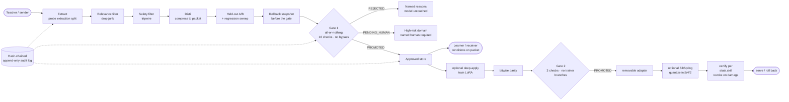

<p align="center">
  
</p>

<h1 align="center">SILT — Skill Interchange Layer with Trust-gating</h1>

<p align="center"><em>The trust gate for AI training.</em></p>

<p align="center"><strong>Your AI trains.<br>Nobody checks its homework.<br>SILT does.</strong></p>
<p align="center"><em>One principle — never trust the process, verify the outcome — and the portfolio of firsts it unlocks.</em></p>

<p align="center">
  <a href="https://github.com/inbharatai/SILT/actions/workflows/ci.yml"></a>
  <a href="https://www.python.org/downloads/"></a>
  <a href="LICENSE"></a>
  
  
  
</p>

> [!NOTE]
> 🛡️ **Patent pending (India).** Indian Provisional Application No.
> **202631101454** (ref `TEMP/E-1/111242/2026-KOL`, docket 25537), filed
> **2026-08-21** by Reeturaj Goswami, assignee **Uni Guru Technologies LLP**.
> Title: *Trust-Gated Skill Packet Transfer and Hardware-Aware Adaptation
> Across Heterogeneous Artificial Intelligence Systems*. Full notice in
> [`PATENT.md`](PATENT.md).

### ⚡ What's new here — the innovation portfolio

*Most of this repo is careful engineering. These parts, as far as we can tell
from our prior-art sweeps, exist nowhere else — each one measured, tested, and
honest about its limits.*

| What it is | Why nothing else does this | Proof in this repo |
| :-- | :-- | :-- |
| 🛡️ **Double Gate** — Gate 1 (16 checks) admits a packet; Gate 2 (14 checks) re-examines the trained result before it sticks. Both all-or-nothing. | Fine-tuning ships what you train; SILT checks twice, and one hard failure at either gate rolls the model back. | [`gate2.py`](src/asea/deepapply/gate2.py) · [`gate.py`](src/asea/promotion/gate.py) · Gate 2 rejected a real run with named reasons — [`deep_apply_real_run_findings.md`](docs/deep_apply_real_run_findings.md) |
| 🔒 **Trainer-independent admission** — Gate 2 has provably zero backend-conditional branches; standard, streamed and ZeroForge backends face the same checks. | The gate cannot quietly lower its bar for a weaker trainer — there is no `if backend == …` path. | static test `"backend" not in gate2.py` — [`test_streamed_backend.py`](tests/test_streamed_backend.py), [`test_deep_apply.py`](tests/test_deep_apply.py) · [`backends/__init__.py`](src/asea/deepapply/backends/__init__.py) |
| 🌊 **SiltStream** — layer-streamed LoRA for low-VRAM cards, with parity as the admission bar; a parity failure aborts (`DeepApplyBlocked`), never a silent fallback. | Streaming trainers drift silently; SILT refuses to train unless streamed matches resident execution. | [`backends/__init__.py`](src/asea/deepapply/backends/__init__.py) · parity-abort covered in backend tests. *Honest limit: the CUDA streamed runtime was not verified on this machine — see "NOT VERIFIABLE HERE" in [`deep_apply_real_run_findings.md`](docs/deep_apply_real_run_findings.md).* |
| 🔥 **ZeroForge** — forward-only, zeroth-order LoRA (SPSA / MeZO-spirit); `backward_passes == 0` is recorded to make the claim auditable. | Trains where backprop physically can't go (no GPU, quantized inference engine); designed to sit behind Gate 2. | [`zeroforge.py`](src/asea/deepapply/backends/zeroforge.py) · `assert backward_passes == 0` in [`test_streamed_backend.py`](tests/test_streamed_backend.py). *Honest limit: a stochastic method, exercised on the toy path — no real-HF ZeroForge run is recorded in-repo.* |
| 🌀 **SiltSpring** — per-(state, skill) capability certificates for int8 / int4 / int2; a revoked or stale pair refuses to serve. | The industry quantizes and hopes; SILT certifies which skills survive each state and refuses to serve a skill its state lost. | [`certifier.py`](src/asea/spring/certifier.py) · [`test_siltspring_certification.py`](tests/test_siltspring_certification.py). *Honest limit: unit tests exercise the toy SpringModel path; real-HF state certification is opt-in only (it downloads a model).* |
| ⚖️ **Asymmetric SPRT** — early-stop that can only REJECT early, never early-promote; `should_stop` is true only on a REJECT verdict. | A standard SPRT can stop early on a lucky streak and promote a skill that hasn't proven itself; SILT's cannot. | [`sprt.py`](src/asea/sprt.py) |
| 🔏 **Signed Capability Diff** — a tamper-evident signature over what changed between two capability states, verifiable later. | Honest about scope: local HMAC-SHA256, tamper-evident to the local key holder only — *not* a portable third-party attestation (B1b is deliberately not built). | [`capability_diff.py`](src/asea/capability_diff.py) (`asea diff` / `asea diff-verify`) |
| 🧹 **Verified Unlearning** — a signed report that the skill is absent from the approved set the receiver reads and held-out capability reverted to baseline within tolerance. | Verified at the skill layer, not the weight layer — SILT trains no weights, so it does not claim weight-level forgetting. | [`unlearning.py`](src/asea/unlearning.py) (`asea unlearn` / `asea unlearn-verify`) |
| 🚫 **Honest refusal as architecture** — bad inputs, missing humans, stale certificates and parity failures raise typed, named errors — never warnings, never silent fallbacks. | A rejection with named reasons is the system working; refusal is the product, not an error to handle. | [`core/errors.py`](src/asea/core/errors.py) · the typed-error table in the "Honest refusal" section below |

The combination of these mechanisms is patent-pending (India, app. no.
**202631101454**) — see [`PATENT.md`](PATENT.md) for the inventive families.
Two adversarial audits tried to break the gates:
[`docs/loophole_audit.md`](docs/loophole_audit.md) and
[`docs/audit_2026-08-13.md`](docs/audit_2026-08-13.md).

### 🚀 Get started

A 60-second path from clone to a gated skill transfer:

```bash
git clone https://github.com/inbharatai/SILT.git && cd SILT
python -m pip install -r requirements.txt          # core: pydantic only, no torch
PYTHONPATH=src python -m pytest tests/ -q           # 420+ passing, offline
PYTHONPATH=src python -m asea.cli run --config configs/assamese_transfer.json --workspace .work
PYTHONPATH=src python -m asea.cli report --workspace .work
```

Optional extras, the full CLI, the mock flows and Windows / PowerShell notes
are in [Quick start](#quick-start) below.

📖 **Public teaser** (the brand page — patent app. no. **202631101454** is on it):
[`docs/teaser.html`](docs/teaser.html) in this repo, or open your local copy —
<a href="file:///C:/Users/reetu/Downloads/silt-the-trust-gate-for-ai-learning-public-teaser%20(1).html">silt-the-trust-gate-for-ai-learning-public-teaser (1).html</a>.

<p align="center">
  <a href="#architecture-at-a-glance">Architecture</a> ·
  <a href="architecture.md">Design</a> ·
  <a href="risk_report.md">Risk report</a> ·
  <a href="#silt-studio">Studio</a> ·
  <a href="#the-flows">Examples</a> ·
  <a href="CHANGELOG.md">Changelog</a> ·
  <a href="CONTRIBUTING.md">Contributing</a> ·
  <a href="SECURITY.md">Security</a> ·
  <a href="docs/teaser.html">Public teaser</a>
</p>

---

> [!IMPORTANT]
> **Measured admission, not blind training.** A skill crosses the gate only
> after it proves itself on cases the teacher never saw — through a
> **non-bypassable all-or-nothing gate**, **structural human sign-off** for
> medical / legal / finance, a **tamper-evident audit trail**, and
> **one-command rollback**. Local-first — **₹0 cloud**.

### 🧱 The six guarantees

| | Guarantee | What it means |
| :-- | :-- | :-- |
| 🎯 | **Measured admission** | A skill is admitted only after held-out proof it helps — the [asymmetric SPRT](src/asea/sprt.py) early-rejects, never early-promotes (see the portfolio row above). |
| 🔒 | **All-or-nothing gate** | Gate 1 runs 16 checks as one verdict — no bypass argument, no partial pass, no silent skip. |
| 🩺 | **Human sign-off** | High-risk domains (medical / legal / finance) require a *named* human in the audit log — structurally non-bypassable. |
| 📜 | **Tamper-evident audit** | Every decision lands in a hash-chained, append-only log — the single source of truth. |
| ↩️ | **One-command rollback** | Each admitted skill carries a rollback token bound to a pre-admission snapshot; undo is one command. |
| 🏠 | **Local-first** | Keys, weights and audit stay on your host — nothing is uploaded. Runs on consumer hardware, ₹0 cloud. |

A local-first adapter that connects two AI modules — one acting as
**Sender/Teacher**, one as **Receiver/Learner** — and moves *inspectable
skill packets* between them under an evaluation gate. A skill crosses only
after it proves itself on cases the teacher never saw. SILT is a **trust
layer, not a trainer**: it decides whether a trained skill may be *admitted*
to a receiver, with held-out proof, a non-bypassable gate, and a
hash-chained audit trail.

> [!TIP]
> *Like river silt, skills here are deposited only after filtration — settling
> in layers, enriching what they reach, with the sediment that failed the
> gate left behind.*

> **Naming.** SILT is the project brand; the Python package imports as `asea`
> (Adaptive Skill Extraction Adapter, the working name it was built under) —
> the same brand/import split as scikit-learn/`sklearn`. Existing code and
> `ASEA_*` environment variables are unaffected.

---

## Architecture at a glance

```
        ┌────────────────────────────────  SILT  ────────────────────────────────┐
        │                                                                         │
  Teacher ─► Extract ─► Relevance ─► Safety ─► Distil ─► Held-out A/B ─► Snapshot ─► Gate 1 ─► Approved store ─► Learner
  (sender)   "probe"   "drop junk"   "tripwire" "compress"  "prove it"   "reversible"  all-or-nothing   "receiver reads"
        │                                                                         │
        │            [ hash-chained, append-only audit log — single source of truth ]│
        │                                                                         │
        │   ┌── optional deep-apply  (`[deep]` extra) ──────────────────────────┐  │
        │   │  approved packets ─► train LoRA ─► parity ─► Gate 2 ─► admit adapter │  │
        │   └────────────────────────────────────────────────────────────────────┘  │
        │   ┌── optional SiltSpring  (compression + certification) ───────────────┐  │
        │   │  model ─► quantize int8/int4/int2 ─► certify per (state, skill) ─► serve│ │
        │   └────────────────────────────────────────────────────────────────────┘  │
        └─────────────────────────────────────────────────────────────────────────┘
```

<details>
<summary><b>Same pipeline as a Mermaid diagram</b> (renders on GitHub)</summary>



</details>

Three surfaces share one gate discipline and one audit log:

| Surface | What it does | Default? | Extra |
|---|---|---|---|
| **Transfer** (packet mode, L3) | extract a skill packet from the teacher, gate it, hand it to the learner | yes | — |
| **deep-apply** (weights mode, L4) | train a removable LoRA adapter from *already-promoted packets*, then re-gate (Gate 2) | optional | `[deep]` |
| **SiltSpring** (compression) | quantize a model to int8/int4/int2 and certify each state still passes the skill | optional | `[deep]` |

Plus two signed reporting tools: **Capability Diff** (B1a) and **Verified
Unlearning** (B3) — both locally HMAC-signed, both honest about their limits.

---

## What the "trained model" actually is (read this first)

By default, SILT **trains no weights**. There is no trainer in the core
install and the design forbids one inside the adapter
(`src/asea/distill/export.py`: *"This system does not train models. It
cannot."*). The promoted artefact is an inspectable **skill packet** — a JSON
lexicon, glossary, rule list, or exemplar set. At inference time the receiver
*conditions on* the packet: its redacted payload is injected into the
receiver's system prompt by `render_skills`
(`src/asea/modules/real/prompting.py:90`).

So by default **"the trained model" = receiver model + approved skill packet.**
That is what you download (see [Downloading the trained model](#downloading-the-trained-model)).
For the L5 level, SILT additionally emits a distillation **dataset** and a
`NOT_EXECUTED` training **job spec** you take to an external trainer — a recipe,
not a trained adapter. No "% of knowledge transferred" appears anywhere,
because no such measurement exists.

> ### Optional weights mode — deep-apply (double-gated)
> There is an **optional**, separately-installed stage — `pip install -e ".[deep]"`
> (adds torch/transformers/peft/accelerate/sentencepiece) — where SILT itself
> trains a LoRA adapter on the receiver using **only packets that already
> passed Gate 1**, then gates the trained adapter **again (Gate 2)** before
> admission. Packet mode (L3, default — no weights touched) and weights mode
> (L4, deep-apply — a removable LoRA adapter) coexist, both gated, both
> reversible, both audited. The core principle is unchanged: **Gate 2 never
> trusts the trainer** — it has zero backend-conditional branches; it measures
> the trained artifact's outcome on the held-out split plus a regression sweep.
> High-risk source domains park the adapter at `PENDING_HUMAN` regardless of
> scores, not disableable. Adapters are removable by construction; v1 never
> merges into base weights. See [`docs/deep_apply_design.md`](docs/deep_apply_design.md)
> and the as-built real-run numbers in
> [`docs/deep_apply_real_run_findings.md`](docs/deep_apply_real_run_findings.md).

---

## What this is, and what it is not

**It is:** a protocol, a set of registries, a filter chain, a benchmark harness
with enforced split discipline, an evaluator, a promotion gate with
non-negotiable rules, physically separated candidate/approved storage, rollback
snapshots, a hash-chained audit log, an optional gated LoRA trainer with three
backends, a compression certifier, and a local web Studio. All real, tested code.

**It is not:** AGI, model copying, weight transfer, or autonomous self-training.
The core install trains no weights. The optional `[deep]` extra can train a
LoRA adapter, but only from already-promoted packets and only behind a second
gate that measures the outcome — never an automatic, unverified weight update.
One model cannot become a copy of another, and this system will not pretend
otherwise. See [`docs/feasibility_review.md`](docs/feasibility_review.md).

> ### Real models are supported — and were actually run
> `src/asea/modules/real/` contains working connectors for **Ollama** (laptop, 7B+),
> **HuggingFace causal LMs** (Qwen/Gemma/Llama) and **HF seq2seq translators**
> (NLLB-200, which genuinely covers Assamese), plus real embedding similarity.
> Recorded real runs (verbatim in `docs/`):
> - **Packet mode** — NLLB-600M teacher → Qwen2.5 student, strict policy, no mock
>   bypass: [`docs/real_run_findings.md`](docs/real_run_findings.md) (a rejected
>   packet, a promoted one, two bugs the exercise exposed).
> - **Assamese TTS G2P** — GLM teacher → Qwen3.5 learner, **PROMOTED**, every gate
>   check passing: [`docs/SILT_TTS_G2P_TEST.md`](docs/SILT_TTS_G2P_TEST.md).
> - **deep-apply** — SmolLM2-135M (CPU) and Qwen2.5-7B-Instruct 4-bit QLoRA (RTX
>   5050) on both the streamed and zeroforge backends: finite loss, parity
>   verified, Gate 2 verdicts recorded honestly (rejection = the system working,
>   mechanism proven not promotion). See
>   [`docs/deep_apply_real_run_findings.md`](docs/deep_apply_real_run_findings.md).
> - **SiltSpring** — Qwen2.5-0.5B quantized to int8/int4/int2, all three states
>   certified; Qwen2.5-1.5B int2 correctly *revoked* for degradation.
>
> See [`LOCAL_SETUP.md`](LOCAL_SETUP.md) to run it yourself.

> ### ⚠️ The four `flow_a..d` demos use mocks — read their numbers accordingly
> Those examples use deterministic lookup-table modules in
> `src/asea/modules/mock/`, each reporting `is_mock = True`. That flag flows into
> packet provenance and the **default promotion policy rejects mock-derived
> packets**; the demo scripts disable the check in order to run at all, and say so
> loudly. Their gains (+0.13 to +0.72) prove the *plumbing* works and say nothing
> about model quality. With real weights the honest translation delta was
> **+0.053**. Run `flow_real_assamese.py` for the real thing.

---

## Can a complete skill auto-transfer from teacher to learner?

Short answer: **no weight copying, ever — but yes, a skill can move across
automatically once it proves itself.** SILT is a trust/gate layer, not a model
copier; one model cannot become a copy of another. What crosses is an
**inspectable skill packet**, and only after it beats the learner on cases the
teacher never saw.

### Your Hindi example, end to end

Teacher = a model fully trained in Hindi. Learner = a model with ~0 Hindi.

1. **Probe** the Hindi teacher on a benchmark suite (e.g. `hindi_english`,
   hi→en, or `assamese_english`, as→en). The teacher answers; its raw outputs
   are kept for audit.
2. **Relevance filter** drops anything that won't help the learner: cases where
   the *teacher was itself wrong* (`sender_incorrect`), cases the learner
   already nails (`receiver_competent`), and duplicates.
3. **Safety tripwire** drops anything rule-flagged (PII, prompt injection, …).
4. **Distil** the survivors into a **skill packet** — JSON: a Hindi→English
   glossary, translation rules, and exemplars. Raw teacher output is then
   discarded.
5. **Held-out A/B** — score the 0-Hindi learner **alone** vs **learner +
   packet** on held-out cases the teacher never saw. `baseline` vs `candidate`;
   `improvement = candidate − baseline`.
6. **Gate 1 (all-or-nothing)** — every check must pass (improvement ≥ 0.01,
   evaluator ≥ 0.60, no regression, no control-suite bleed, provenance clean,
   no mock, rollback token present, …). One hard failure → `REJECTED` with
   named reasons.
7. **Admit** — the packet lands in `approved/`; the learner **conditions on it**
   at inference (its redacted payload is injected into the learner's system
   prompt via `render_skills`, `modules/real/prompting.py:90`).

The learner now performs Hindi→English **as far as the packet proves on unseen
tests** — genuinely useful, but it is **not** the teacher's weights
reincarnated, and no "% of Hindi transferred" number is shown anywhere because
that measurement does not exist.

### "Auto" — yes, with guardrails

The pipeline runs end-to-end automatically, and for a **non-high-risk** language
task it **can auto-promote** if every gate check passes. The guardrails that
make "auto" safe:

- **All-or-nothing** — a single hard-check failure rejects the packet; no
  aggregate score can drown it out.
- **Reversible** — a rollback snapshot is taken *before* the gate, so any
  admission can be undone (`rollback`).
- **High-risk parks, never auto-promotes** — medical / legal / finance domains
  stop at `PENDING_HUMAN` regardless of scores until a named approver re-runs
  the full gate.
- **No `bypass` argument** exists on the gate — the only way to act on a
  refusal is to catch `PromotionBlocked`; there is no override.

### Want weights, not packets? — optional deep-apply (L4)

If you install `[deep]`, SILT can train a **removable LoRA adapter** on the
learner from *already-Gate-1-promoted* packets — but behind a **second gate
(Gate 2)** that never trusts the trainer, with parity as the admission bar.
This is the closest SILT gets to "weights transfer," and it is still: a
removable adapter, trained only from proven packets, re-gated on held-out
evidence, never merged into base weights in v1. See
[Optional surfaces — deep-apply](#optional-surfaces).

> Recorded real run: NLLB-200 (genuinely covers Hindi + Assamese) → Qwen2.5
> student, strict policy, no mock bypass — honest held-out delta **+0.053**
> ([`docs/real_run_findings.md`](docs/real_run_findings.md)).

---

## Quick start

```bash
git clone https://github.com/inbharatai/SILT.git
cd SILT

# core (packet mode): pydantic + pytest
python -m pip install -r requirements.txt

# pick an optional extra as needed:
python -m pip install -e ".[studio]"      # the web Studio (fastapi + uvicorn)
python -m pip install -e ".[connectors]"  # real HF/Ollama connectors (transformers + torch + sentence-transformers)
python -m pip install -e ".[deep]"        # deep-apply + SiltSpring (adds peft/accelerate/sentencepiece)

# tests (needs PYTHONPATH so `asea` + the `tests` package both resolve on Windows)
PYTHONPATH=src python -m pytest tests/ -q     # 420+ passing, 6–7 skipped (offline; the live CI badge is the source of truth)

# all four mock demonstration flows
cd examples && python run_all.py && cd ..

# or drive it from the CLI
PYTHONPATH=src python -m asea.cli suites
PYTHONPATH=src python -m asea.cli run --config configs/assamese_transfer.json --workspace .work
PYTHONPATH=src python -m asea.cli report --workspace .work
PYTHONPATH=src python -m asea.cli audit  --workspace .work
```

> **Windows / PowerShell:** `PYTHONPATH=src` as a prefix does not work in
> PowerShell — set it as an env var first: `$env:PYTHONPATH="src"; python ...`.
> Use forward slashes in paths. The full suite needs `PYTHONPATH` to include both
> `src` and the project root (`PYTHONPATH="src;<project>"`) because
> `tests/test_adversarial.py` imports from the `tests` package.

---

## The pipeline, end to end

`src/asea/core/pipeline.py:Pipeline` runs the full chain. Each stage is a real,
tested class:

| Stage | File : class | Role |
|---|---|---|
| Register / bind adapter | `core/pipeline.py` `Pipeline` + `registry/registries.py` | modules register once; sender/receiver roles enforced; adapter binding is scoped; self-transfer refused |
| Handshake / session | `core/handshake.py` `Handshake` → `Session` | exchange manifests, validate modality overlap + role compatibility + level, refuse self-transfer |
| Gap negotiation | `core/gap.py` `GapEngine` (`GapPolicy`) | intersect declared capabilities with **measured** extraction-split scores; actionable only if receiver < 0.85 ceiling and headroom ≥ 0.05 |
| Extraction | `extraction/extractors.py` `TextExtractor`/`TTSExtractor`/`CodeExtractor`/`StructuredExtractor` | probe the sender on the *extraction* split; keep `sender_output` for audit, leave `distilled_skill` empty |
| Relevance filter | `filters/relevance.py` `RelevanceFilter` (`RelevancePolicy`) | drop `sender_incorrect` / `receiver_competent` / `no_delta` / `duplicate` — requires sender *correct* (floor 0.75), not merely confident |
| Safety filter | `filters/safety.py` `SafetyFilter` | rule-based tripwire (not a classifier): `safety_score` 0..1; blocking findings `credential_leak`, `self_harm`, `prompt_injection`, `dosage_instruction`, `diagnostic_certainty`, `pii` |
| Distillation | `distill/strategies.py` `TextDistiller`/`TTSDistiller`/`CodeDistiller`/`StructuredDistiller` | compress filtered packets into an inspectable payload; set `sender_output=None`; prefer the verified reference over sender output (`taught_value`) |
| Held-out evaluation | `evaluator/evaluator.py` `Evaluator` + `benchmarks/harness.py` | before/after A/B on the *heldout* split (baseline = receiver alone, candidate = receiver + skill) + a regression sweep; optional **SPRT** early-stop |
| Snapshot | `memory/store.py` `RollbackLayer.snapshot` | copy the approved set to a timestamped dir **before** the gate, so any promotion is reversible |
| Promotion gate | `promotion/gate.py` `PromotionGate` | the all-or-nothing checks below — no aggregate can drown out a single hard failure |
| Audited storage | `memory/store.py` `MemoryStore` + `audit/logger.py` `AuditLog` | physically separate `candidate/`/`approved/`/`rejected/`/`snapshots/`; approved is the **only** dir the receiver reads; hash-chained append-only audit log (thread-locked, fsync) |
| Rollback | `memory/store.py` `RollbackLayer.rollback` | restore the approved set from a snapshot token |
| Human-in-the-loop | `core/pipeline.py` `approve_pending` | re-runs the **full** gate; human approval satisfies exactly one check, never waives others |
| L4/L5 export (spur) | `distill/export.py` `export_dataset` + `build_job_spec` + `export_artifact_bundle` | emit a validated JSONL dataset + a `NOT_EXECUTED` job spec + a downloadable skill-packet bundle; the gate refuses L4/L5 to a live receiver, so export is their only path |

---

## The double gate — all-or-nothing

A packet (Gate 1) or a trained adapter (Gate 2) promotes **only if every
emitted check passes**. There is no aggregate score and no code path that
promotes without going through `decide()`. "Hard" = not relaxable by any
config; "soft" = a threshold you can tune in a config file (never in the
Studio, which uses the strict defaults).

```
  packet candidate ─► Gate 1 (all-or-nothing) ─► PROMOTED ─► approved store
                         │                           │
                      REJECTED (named)          PENDING_HUMAN  (medical / legal / finance)
                                                    │
                                            named human ─► re-run FULL Gate 1 ─► PROMOTED

  [optional deep-apply]  approved packets ─► train LoRA ─► Gate 2 (all-or-nothing, never trusts trainer) ─► PROMOTED adapter
                                                    │
                                       REJECTED / DeepApplyBlocked / ParityError
```

### Gate 1 — `src/asea/promotion/gate.py:PromotionGate.decide`

Up to **16 checks**; under the default policy for a non-high-risk domain,
**15** are emitted (13 always-on + `rollback_metadata` + `no_mock_provenance`,
both on by default). A 16th, `human_approval`, is appended when the domain is
medical / legal / finance. **Two are soft**; the rest are hard.

| # | Check | Hard? | Default |
|---|---|---|---|
| 1 | `schema_validation` | hard | schema_compliance ≥ 1.00 |
| 2 | `distilled_payload_present` | hard | distilled_skill present |
| 3 | `evaluator_threshold` | **soft** | evaluator_score ≥ 0.60 |
| 4 | `safety_threshold` | hard | safety_score ≥ 0.70 |
| 5 | `benchmark_improvement` | **soft** | improvement ≥ 0.010 |
| 6 | `no_regression` | hard | no regression detected |
| 7 | `case_regression_limit` | hard | regressed-case ratio ≤ 1.00 |
| 8 | `no_control_movement` | hard | control-suite movement ≤ 0.05 (symmetric — improvement *or* regression trips it; the "bleed") |
| 9 | `no_statistical_early_reject` | hard | no SPRT early-reject record (`scores.sprt` is None) |
| 10 | `provenance_present` | hard | provenance chain non-empty |
| 11 | `synthetic_depth` | hard | synthetic_depth ≤ 2 (model-collapse brake) |
| 12 | `no_self_transfer` | hard | receiver absent from provenance chain |
| 13 | `rollback_metadata` | hard | rollback token present (when `require_rollback_token`, default True) |
| 14 | `applicable_learning_level` | hard | level in {L0,L1,L2,L3} (L4/L5 export-only) |
| 15 | `no_mock_provenance` | hard | provenance excludes a mock module (`strict_no_mock`, default True) |
| 16 | `human_approval` | hard, **non-configurable** | named human approver required for **medical / legal / finance** |

The last rule is not configurable. A test constructs a maximally permissive
policy and asserts a medical packet still stops at `PENDING_HUMAN`. There is
intentionally **no `bypass` argument** on `PromotionGate.apply`/`enforce` — the
only way to act on a refused packet is to catch `PromotionBlocked`; the gate
provides no override.

### Gate 2 — `src/asea/deepapply/gate2.py:DeepApplyGate`

Reuses `Check` / `GateDecision` / `PromotionPolicy` from Gate 1 but **not**
`PromotionGate` itself. Up to **16 checks**, with three distinct from Gate 1:
`training_loss_finite` (a NaN/Inf sanity guard — **explicitly not** a quality
endorsement; it does not trust the trainer's claim that training *worked*, only
that it did not produce non-finite numbers), `adapter_artifact_present`
(requires a real adapter artifact + `trainable_param_count ≥ min`), and
`no_self_lineage` (receiver not in any source packet's chain). The
`applicable_learning_level` check admits **L4 PEFT only** here (the whole point
of deep-apply); L5 stays export-only. High-risk source domains still force
`PENDING_HUMAN` at Gate 2 regardless of scores. `DeepApplyGate.apply` likewise
has no `bypass` argument.

---

## Honest refusal — typed, named errors

Anything that would degrade, fabricate, or silently serve a worse result
raises a **typed, named error** instead of a warning or fallback. All inherit
from `AseaError` (`src/asea/core/errors.py`).

| Error | Where | Meaning |
|---|---|---|
| `PromotionBlocked` | `core/errors.py` | a packet/adapter was refused by the gate (the only way to act on a refusal) |
| `BatchedInferenceError` / `InferenceCountMismatchError` | `core/errors.py` | OOM or count-mismatch during batched inference — **no silent truncation/zip** |
| `CacheCorruptionError` | `core/errors.py` | the teacher-score cache is corrupt on disk (not a stale serve) |
| `AuditIntegrityError` | `core/errors.py` | the hash chain is broken |
| `SnapshotNotFoundError` / `RollbackError` | `core/errors.py` | rollback target missing |
| `DeepApplyIntakeError` | `deepapply/errors.py` | training-data intake refused (non-promoted packet / mock) |
| `DeepApplyBlocked` | `deepapply/errors.py` | deep-apply cannot run (missing `[deep]` extra, no CUDA for a big model, unsupported architecture) — names the remedy, never a silent CPU fallback |
| `AdapterNotPromoted` | `deepapply/errors.py` | attempt to admit an adapter that did not pass Gate 2 |
| `ParityError` | `siltstream_vendor/errors.py` | the streamed/zeroforge parity probe failed (wrapped by `DeepApplyBlocked`, raised **before** Gate 2) |
| `BudgetError` / `StateNotCertifiedError` / `StaleCertificateError` | `siltstream_vendor/spring.py` | SiltSpring: no state fits the memory budget / no certified state for the required skills / the model changed since certification |
| `SignatureMismatchError` / `SigningKeyError` | `core/errors.py` | a signed diff/unlearning report fails HMAC verification — a missing key is **never** a silent pass |

A 7B model on a CPU-only host is blocked by name (`DeepApplyBlocked`) — never a
fabricated training log. A non-CausalLM architecture is blocked by name — never
a silent fallback. The Studio is structurally unable to serve a mock
(`is_mock` is re-checked at `catalog.build`, `studio/catalog.py:228`).

---

## Optional surfaces

### deep-apply — three gated LoRA backends (`src/asea/deepapply/`)

`DeepApplyRunner` (`runner.py`) builds a training dataset from **only the
packets that already passed Gate 1** (`build_training_dataset`, refuses
non-promoted via `DeepApplyIntakeError`), trains a LoRA adapter via one of
three backends, runs a held-out A/B + regression sweep, then Gate 2 decides.
Adapters live in a physically separate `candidate_adapters/` /
`approved_adapters/` / `rejected_adapters/` / `snapshots/` store
(`deepapply/store.py`) and are removable by construction.

Backends are registered in `deepapply/trainer.py`; Gate 2 treats them
identically (zero backend-conditional branches — `backends/__init__.py:18`):

| Backend | Class | How it trains | Parity? |
|---|---|---|---|
| `standard` | `StandardTrainerBackend` (`trainer.py:297`) | model resident on device; CPU-graceful for small models | no parity probe — Gate 2's all-or-nothing checks are the bar |
| `streamed` | `SiltStreamBackend` (`backends/streamed.py`) | low-VRAM **layer-streamed** LoRA (siltstream vendor): frozen base streams one layer at a time, peft LoRA on device | **parity is the admission bar** — unverified → `parity_verified=false`; fail → `DeepApplyBlocked` wrapping `ParityError`, before Gate 2 |
| `zeroforge` | `ZeroForgeBackend` (`backends/zeroforge.py`) | forward-only **zeroth-order** LoRA (central-difference SPSA / MeZO-spirit), `backward_passes == 0` | runs a forward-parity check; fail → `DeepApplyBlocked` |

The vendored first-party `siltstream` package (Apache-2.0, v0.1.0) lives at
`src/asea/deepapply/backends/siltstream_vendor/` — layer streaming, banking,
parity, the SpringModel, the real-HF bridge (`hf_real.py`), and the quantizer.
Do **not** edit the vendor in-place; fixes belong in the standalone siltstream
first, then re-vendor.

### SiltSpring — compression + certification (`src/asea/spring/`)

`CompressionCertifier` (`spring/certifier.py`) is the third SILT surface. It
quantizes a model to **int8 / int4 / int2** and certifies each compressed
state **per (state, skill)** against the same held-out suites the gate uses.
A state that degrades a skill beyond `tolerance` (default 0.02, **directional**
— only a *worse* loss revokes; a favorable change is "not degraded" by design)
has that skill **revoked** at that state. `choose_state()` picks the
highest-quality state that fits the memory budget **and** is certified for the
required skills — or raises `BudgetError` / `StateNotCertifiedError`. A
**stale** certificate — the model's LoRA fingerprint changed since certification
(`is_stale()`) — refuses to serve (`StaleCertificateError`). Certificates bind
to the LoRA fingerprint, not the model identity.

**How it works** (`CompressionCertifier` + vendored
`siltstream_vendor/hf_real.py:certify_hf_states`):

1. **Pick** a model from the catalog + the held-out suites whose skills you want
   certified + `levels` ⊆ {`int8`, `int4`, `int2`} + `tolerance` (default 0.02).
2. **Build certification suites** from SILT's held-out cases
   (`suites_from_benchmark` → `{skill: input_ids}`) — the same cases Gate 2 uses.
3. **Measure the full-precision reference** — per-skill loss with the model
   resident (`suite_loss`).
4. **Quantize + stream, one level at a time** — bank the model's decoder layers
   to disk as **symmetric per-channel int8 / int4 / int2** (float32 scale per
   row; 1-D norm/bias tensors stay float32; dequant is exact → deterministic)
   (`siltstream_vendor/quant.py`), then run the model's *own* forward with each
   layer materialized from the bank just before it executes and freed after
   (`HFStreamer` pre/post hooks). Streaming means an **8 GB card can certify a
   7B model** — only one decoder layer is resident at a time.
5. **Certify per (state, skill)** —
   `degradation = (loss_state − loss_ref) / |loss_ref|`; `≤ tolerance` →
   **certified**, `> tolerance` → **revoked** (directional: only a *worse* loss
   revokes; a favorable change is "not degraded").
6. **Choose** — `choose_state(budget, required_skills)` returns the
   highest-quality state that fits the memory budget **and** is certified for
   *all* required skills; else `BudgetError` / `StateNotCertifiedError`.
7. **Serve** — `serve(state, skill)` refuses a revoked/uncertified pair
   (`StateNotCertifiedError`) or a stale one (`StaleCertificateError`) — never
   silently serves degraded output.
8. **Staleness** — certificates bind to the **LoRA fingerprint**, not the model
   id; admitting a new adapter changes the fingerprint → every prior certificate
   is stale → refuse until `certify()` is re-run. A certificate for yesterday's
   model must never authorize today's.
9. **Audit** — `certify` / `choose_state` / `serve` / `admit_skill` each append
   to the **same** hash-chained `AuditLog` as packets and adapters.

The **spring metaphor**: a model *rests* compressed (int2/int4 — small enough
for weak hardware) and *expands* to higher precision when memory allows. A
quantized streamer must re-expand to full precision on exit (vendor guard B2:
a spring that cannot re-expand is a silent compression trap), so the
full-precision layers are banked once as the `restore_bank` and handed to every
quantized streamer.

**What AI it can compress** — any HuggingFace **causal LM**
(`AutoModelForCausalLM`) whose decoder-layer stack lives at one of the paths
`get_decoder_layers` recognises (`siltstream_vendor/hf_real.py:44`):

| Layer stack | Model families (examples) |
|---|---|
| `model.layers` | Llama / Llama 2-3, **Qwen / Qwen2 / Qwen2.5**, **Gemma**, Mistral, Phi, **SmolLM / SmolLM2**, Yi, DeepSeek |
| `transformer.h` | GPT-2, GPT-Neo, GPT-J |
| `gpt_neox.layers` | GPT-NeoX |

**Cannot compress (honest limits):**
- **Seq2seq / encoder-decoder models** (NLLB-200, mBART, T5, BART) —
  `AutoModelForCausalLM` + a decoder-stack search can't see them; use a causal
  LM instead.
- **An architecture whose decoder stack isn't at one of the three paths above**
  → raised by name as `UnsupportedModelError` (never a silent fallback). Adding
  a path is a small, localized edit to `get_decoder_layers`.
- **Validated in-repo** on SmolLM2-135M (Llama-family) CPU fp32; other families
  **must be re-validated before trust** (the vendor docstring says so). Recorded
  real runs: **Qwen2.5-0.5B** quantized to int8/int4/int2 — all three states
  certified; **Qwen2.5-1.5B** int2 correctly *revoked* for degradation.

Run it from the **Compress** tab (`POST /api/spring`, `levels` ⊆ {int8,int4,int2},
`device` = auto / cpu / cuda) or the CLI; the Studio job loads
`AutoModelForCausalLM.from_pretrained(<id>)` (fp16 on GPU, fp32 on CPU), banks
the full-precision layers once as the re-expand source, streams each quantized
state, and reports per-state certified/revoked skills, `bytes_packed`, and peak
VRAM (`vram_peak_gb`).

### SPRT early-stop — asymmetric (`src/asea/sprt.py`)

An **asymmetric** sequential probability ratio test: it may **early-REJECT**
(≥95% confidence, false-reject rate bounded by `beta`) but may **never
early-promote**. `should_stop()` returns True *only* on a REJECT verdict; the
promote boundary is computed and reported but is never a stop trigger. When a
candidate held-out run is stopped early, `scores.sprt` is populated, and Gate
1's hard `no_statistical_early_reject` check fails — by asymmetry that record
can only ever be a REJECT. `SprtConfig`: H0 `P(regress)=0.5`, H1
`P(regress)=0.1`, `alpha=beta=0.05`.

### Capability Diff — signed (`src/asea/capability_diff.py`)

`CapabilityDiffer` reuses the evaluator's scoring path to compute per-capability
held-out score deltas between two approved-set snapshots, flags
`improved`/`regressed`/`moved` independently, and emits a locally **HMAC-signed**
`DiffReport` (key file `diff.key`). Packet add/remove is by 16-char content hash
over `{capability, distilled_skill}`, **not** packet_id (uuids regenerate on
re-run, so an id-based delta would fake churn). CLI: `asea diff` /
`asea diff-verify`. **Honesty boundary:** local HMAC, not portable asymmetric
attestation — portable attestation (B1b) is deliberately not built (out of
scope of this release).

### Verified Unlearning — signed (`src/asea/unlearning.py`)

`UnlearningVerifier` proves a rollback removed a skill: three held-out
measurements — `baseline` (receiver alone), `with_skill` (snapshot before
rollback), `post_rollback` (snapshot after) — then `adapter_removed` (content
hash delta, not packet_id) AND two-sided `capability_gone`
(`abs(residual) ≤ tolerance`; a post far *below* baseline is a harmful after-set,
not a reversion) → `verified`; `substantive` additionally requires the skill
actually conferred lift. Emits a locally HMAC-signed `ErasureCertificate` (key
file `unlearn.key`, distinct from `diff.key` so the two report types cannot
cross-forge). CLI: `asea unlearn` / `asea unlearn-verify`. **Honesty boundary
(verbatim):** verified **skill-layer** unlearning — SILT trains no weights; a
receiver connector with internal state may retain capability independently,
which is out of scope and not claimed. This is **not** weight-level forgetting.

---

## Learning levels

| | Meaning | Status |
|---|---|---|
| L0 | interaction only | supported |
| L1 | context injection | supported |
| L2 | memory / RAG | supported |
| L3 | **skill packet** | primary path, fully implemented |
| L4 | LoRA / PEFT candidate | **export only by default**; applicable via optional **deep-apply** (weights mode, double-gated) |
| L5 | distillation dataset | **export only** |

The promotion gate refuses to promote L4/L5 to a live receiver through any code
path (`applicable_learning_level` check). The optional deep-apply stage is the
**only** place L4 becomes applicable — and it runs its own second gate (Gate 2)
on the trained adapter before admission.

---

## The flows

| Flow | Sender → Receiver | Transfers | Notable behaviour |
|---|---|---|---|
| **A** Assamese | curated corpus → Qwen | glossary | drops a signal the receiver already knew, drops one where the *sender* was wrong, keeps Hindi flat |
| **B** TTS | AI4Bharat G2P → generic TTS | pronunciation lexicon | payload declares `voice_timbre` as **not** transferable; ASR→TTS binding refused at handshake |
| **C** Coding | strong coder → Qwen | bug-fix fragments | one held-out case intentionally uncovered, so the score is honestly below 1.0 |
| **D** Medical | verified corpus → small assistant | triage red-flag rules | **cannot auto-promote**; parks in `PENDING_HUMAN` until a named approver acts |

`examples/` holds `flow_a_assamese.py`, `flow_b_tts.py`, `flow_c_coding.py`,
`flow_d_medical.py` (all mocks; `run_all.py` runs A–D), plus the real-weight
`flow_real_assamese.py` (NLLB → Qwen2.5, strict) and `flow_real_medical.py`
(Qwen2.5-0.5B → SmolLM2-360M, high-risk → human approval mandatory).

---

## What AI / "engine" does SILT run on?

**SILT ships no model of its own — it is model-agnostic.** SILT's "brain" is
the *gate* (pure Python + pydantic), not a model. You bring the models; SILT
connects to them through real connectors in `src/asea/modules/real/`:

| Connector | Talks to | Deps |
|---|---|---|
| `OllamaConnector` | any locally-served Ollama model (7B+) over HTTP | stdlib only |
| `HFCausalConnector` | in-process HuggingFace causal LMs (Qwen / Gemma / Llama) | `transformers` + `torch` (`[connectors]`) |
| `HFSeq2SeqTranslator` | in-process seq2seq translators (NLLB-200, mBART) — NLLB genuinely covers Hindi + Assamese | `transformers` + `torch` (`[connectors]`) |
| `CorpusSender` | a reviewed file corpus — the safest "teacher" for high-risk domains | none |
| real embeddings | `sentence-transformers` similarity for relevance / eval | `sentence-transformers` (`[connectors]`) |

So the "power engine" is **your choice of model**: point SILT at any Ollama tag
or any HuggingFace repo. Recorded real runs used Qwen2.5, Qwen3.5, SmolLM2,
NLLB-200, and GLM on RTX 5050 and CPU.

The **heavy-compute engine** — only for the optional deep-apply trainer
(`[deep]` extra) — is **PyTorch + PEFT + accelerate** training LoRA adapters,
exposed through three backends (see [Optional surfaces](#optional-surfaces)):

| Backend | Compute shape | When |
|---|---|---|
| `standard` | model resident on device; full backprop | small models, CPU-graceful |
| `streamed` | layer-streamed LoRA (vendored `siltstream`): frozen base streamed one layer at a time | low-VRAM GPUs |
| `zeroforge` | forward-only zeroth-order (SPSA / MeZO-spirit), `backward_passes == 0` | no backprop available / wanted |

The **gate / protocol / audit core** (`asea.core`) needs only pydantic — no
model, no torch. The real connectors and the vendored trainer are the only
places that pull heavy ML deps, and only under their extras. To add a genuinely
new backend, subclass `ModuleAdapter` (`core/interfaces.py:23`) — see
[`docs/connector_authoring.md`](docs/connector_authoring.md).

---

## Inserting & testing an AI model

A "model" in SILT is a `ModuleAdapter` subclass that talks to a real backend
(`src/asea/modules/real/`): `OllamaConnector` (HTTP to a local Ollama server,
stdlib only), `HFCausalConnector` (in-process Qwen/Gemma/Llama), `HFSeq2SeqTranslator`
(NLLB/mBART), or `CorpusSender` (a reviewed file corpus — the safest teacher for
high-risk domains). To insert one and run it through the full pipeline:

1. **Author or pick a connector.** For an Ollama-served model you usually need no
   new code — the `_ollama(...)` factory in `src/asea/studio/catalog.py` builds an
   `OllamaConnector` from a tag. For a genuinely new backend, subclass
   `ModuleAdapter` (`src/asea/core/interfaces.py:23`); see
   [`docs/connector_authoring.md`](docs/connector_authoring.md) for worked Qwen
   and AI4Bharat examples.
2. **Add a `CATALOG` entry** (`src/asea/studio/catalog.py:111`) with a `factory`,
   `roles` (`["sender"]`, `["receiver"]`, or both), a `description`, and
   `requires`. `build()` structurally refuses mocks (`catalog.py:228`).
3. **Health-check + preflight.** `catalog.build("<id>").health()` returns
   `model_present`; the Studio's `create_transfer` re-runs this as a fail-fast
   preflight (`server.py:_preflight_model`) so no job 404s mid-run.
4. **Start a transfer.** `POST /api/transfers` with `sender`, `receiver`,
   `suites`, `similarity`, and (only if needed) `relevance_floor`.
5. **Watch the live audit stream.** `GET /api/transfers/<id>/events` (SSE) tails
   the hash-chained audit log — every live element in the UI is a replay of
   evidence, never invented state.
6. **Read the gate verdict.** `GET /api/transfers/<id>` → the funnel counts
   (extracted / dropped_relevance / distilled / promoted / rejected) and the
   per-check gate decision with named reasons.
7. **Verify integrity.** `GET /api/transfers/<id>/audit` → `integrity.ok: true`.
8. **Inspect the buckets.** `GET /api/transfers/<id>/packets` →
   approved/candidate/rejected + snapshots.
9. **Download the result.** see [below](#downloading-the-trained-model).

---

## Downloading the trained model

The "trained model" is the approved skill packet(s). Download them as a single
bundle — a zip of the approved packet JSON(s) + a flattened dataset + a manifest
+ the audit chain + an honest README, refusing non-PROMOTED and mock-derived
packets by default (`src/asea/distill/export.py:export_artifact_bundle`).

```bash
# From the Studio (the download button):
curl -s -o bundle.zip localhost:8377/api/transfers/<job_id>/export
# With an L4/L5 job spec for an external trainer:
curl -s -o bundle.zip "localhost:8377/api/transfers/<job_id>/export?base_model=Qwen/Qwen2.5-7B-Instruct"

# From the CLI (against a workspace):
PYTHONPATH=src python -m asea.cli export --workspace .studio/<job_id>
PYTHONPATH=src python -m asea.cli export --workspace .work --base-model Qwen/Qwen2.5-7B-Instruct
```

The bundle contains:
- `approved/<packet_id>.json` — the raw promoted skill packet(s); the primary
  artefact the receiver conditions on.
- `manifest.json` — per-packet capability, target, learning level, provenance
  chain, gate verdict.
- `<name>.jsonl` + `<name>.manifest.json` — a supervised dataset flattened from
  the approved packets.
- `<name>.job.json` — **only if `--base-model`/`?base_model=` was supplied**: a
  `NOT_EXECUTED` L4/L5 training job spec (LoRA / sequence KD) to run in an
  external trainer. Omitted for L0–L3 so no fake "training job" is implied.
- `audit.jsonl` — the hash-chained audit trail, if available.
- `README.txt` — the honest usage note (SILT trains no weights).

To **use** an L0–L3 packet at inference time, inject it through the same path the
gate measured: `receiver.infer_with_skills(capability, prompt,
[packet.redacted_for_receiver()])`. No training, no weight surgery.

---

## Universality — adding a new domain or suite

SILT is domain-agnostic in its orchestration: the pipeline core
(`core/pipeline.py`) has no `if modality` branches (enforced by
`tests/test_conformance.py`, which registers a brand-new modality with no core
edit). The only domain-conditional logic is the deliberate risk-tier policy in
`core/protocol.py` (`HIGH_RISK_DOMAINS = {MEDICAL, LEGAL, FINANCE}` →
`RiskTier.HIGH`), which the promotion gate uses to route human approval — not to
branch the pipeline. The plugin registry is keyed by `Modality` only
(`src/asea/core/plugins.py:70`), so a new **domain** reuses an existing
modality's extractor/distiller/metric.

Adding a new domain is **mostly writing data files, not editing core code.**
The full worked example — *a medical-expert AI teaches a weaker medical
assistant*, reusing the already-wired `Domain.MEDICAL` + `Modality.STRUCTURED`
scaffolding — is in [`docs/ADDING_A_DOMAIN.md`](docs/ADDING_A_DOMAIN.md).

**Authoring a new benchmark suite from the Studio.** Suites are pure JSON keyed
by filename stem (no per-suite Python loader), so you can author one without
touching code: the **Suites** tab `POST /api/suites` writes
`data/benchmarks/<suite_id>.json` atomically (409 on duplicate stem, 400 if no
`extraction` *and* no `heldout` case). Each suite defines a capability
(`task_type/modality/domain/language`) plus `extraction` and `heldout` case
sets. If your data does not fit TEXT/CODE/SPEECH_TTS/STRUCTURED,
`connector_authoring.md` points you to the *new modality* path.

---

## SILT Studio — the web platform

A local web UI over the same pipeline. Eight tabs in three groups, with a
pinned **"current run" context bar** (run id · teacher→learner · suite · status)
so the Act-on-run tabs always know which run they are acting on:

| Group | Tabs | What you do |
|---|---|---|
| **Set up** | Suites · Skills · Transfer | author/browse suites; load an AI model by Ollama tag; run a transfer |
| **Act on run** | Packets & Approval · Test · Train | approve/rollback/download the skill; read-only accuracy A/B; (optional) train a LoRA + Gate 2 |
| **Probe** | Playground · Compress | one prompt, base vs with-skills; SiltSpring compress + certify |

```bash
pip install -e ".[studio]"
PYTHONPATH=src python -m uvicorn asea.studio.server:app --port 8377
# open http://localhost:8377
```

Studio rules, enforced in code: **real connectors only** (the catalog
structurally refuses mocks — tested), the strict default gate is never relaxed,
approval requires a typed name and re-runs the full gate, the playground has no
path into the memory store, export is read-only and refuses mock/non-approved
packets by default, and every live element is a replay of the hash-chained
audit stream (Train/Compress stream the runner's live telemetry, not the audit
chain). A **capability hard-reject** (`_assert_support`, `server.py:321`) runs
at every run-creation path — `POST /api/transfers`, `/api/deepapply`,
`/api/spring`, `/api/skills/test` — and returns 400 with the required capability
+ the model's supported list **before any job spawns**. No "% of knowledge
transferred" appears anywhere, because no such measurement exists.

### What SILT shows you — live evidence, not a "% transferred" gauge

There is **no single "graph of everything,"** and deliberately no
"% of knowledge transferred" gauge — that number does not exist, and showing
it would be a lie. Instead, each surface shows **live, per-stage evidence**
streamed from the hash-chained audit log or the trainer's own loop (never
invented state):

| Surface | What you see | Source |
|---|---|---|
| **Transfer** | the **funnel** (extracted → dropped_relevance → distilled → promoted / rejected), a **gate verdict badge** (`PROMOTED` / `REJECTED` / `PENDING_HUMAN`), the per-check decision list with named reasons, and a **live audit stream** | audit log (SSE `/api/transfers/{id}/events`) |
| **Test** | a read-only accuracy **A/B**: `baseline 0.42 · candidate 0.58 · improvement +0.16` plus per-case rows | `/api/skills/test` (read-only, no gate) |
| **Train** (deep-apply) | a **live loss chart** (canvas, `drawLoss`) + per-step telemetry (loss, step, lr, parity status) | `/api/deepapply/{id}/telemetry` (SSE) |
| **Compress** (SiltSpring) | a per-state certification table (int8 / int4 / int2 × skill → certified / revoked), VRAM peak + device, live phase log | `/api/spring/{id}/telemetry` (SSE) |
| **Playground** | side-by-side: one prompt, **base vs with-skills** output (read-only, no path into the store) | `/api/playground` |
| **Packets & Approval** | the approved / candidate / rejected buckets + rollback snapshots; approve / rollback / download | `/api/transfers/{id}/packets` |

Charts appear where a chart is honest (a training-loss curve, a
compression-state table); before/after numbers appear where a gauge would be
dishonest (a transfer). Every live element is a replay of signed evidence — the
audit chain for transfers, the runner's own telemetry for training / compression.

### HTTP endpoints

| Method | Path | Purpose |
|---|---|---|
| GET | `/api/health` | `{ok, service, mock_free: true}` |
| GET | `/api/catalog` | list catalog modules (REAL only) |
| POST | `/api/catalog` | **register an Ollama model at runtime by tag** (preflight `ollama tags`; HTML-breakout guard on description) |
| GET | `/api/suites` | list benchmark suites + split counts + `high_risk` |
| POST | `/api/suites` | **author a new benchmark suite** (atomic write, 409 dup / 400 no split) |
| GET | `/api/suites/{id}/support` | capability-support verdict preview for sender+receiver (`ok`, `reasons[]`) |
| POST | `/api/transfers` | start a transfer job (capability hard-reject + preflight model presence) |
| GET | `/api/transfers` | list all jobs |
| GET | `/api/transfers/{id}` | job status + report (report sanitized against non-finite floats) |
| GET | `/api/transfers/{id}/events` | SSE stream of the audit log |
| GET | `/api/transfers/{id}/packets` | approved/candidate/rejected buckets + snapshots |
| POST | `/api/transfers/{id}/approve` | named human approval (re-runs full gate) |
| POST | `/api/transfers/{id}/rollback` | restore an approved-set snapshot |
| GET | `/api/transfers/{id}/audit` | `{integrity, entries}` |
| GET | `/api/transfers/{id}/export` | **download the skill bundle (zip)** |
| POST | `/api/deepapply` | start a deep-apply (Gate 2) job — `backend` ∈ {standard, streamed, zeroforge} |
| GET | `/api/deepapply` · `/{id}` · `/{id}/telemetry` | list · status · live training telemetry (SSE) |
| POST | `/api/spring` | start a SiltSpring compress+certify job — `levels` ⊆ {int8, int4, int2} |
| GET | `/api/spring` · `/{id}` · `/{id}/telemetry` | list · status · per-state telemetry (SSE) |
| POST | `/api/playground` | one prompt against a module, optionally conditioned on approved skills (read-only) |
| GET | `/api/skills` | **cross-job library of every approved skill packet** (read-only glob) |
| POST | `/api/skills/test` | **accuracy A/B before download**: receiver vs receiver+skills on a suite's held-out split (read-only, no gate) |

Every job's `to_dict` exposes only a typed **error name** (never the raw
exception text or absolute paths — adversarial audit #20), and every serving
boundary runs `json_safe` (`studio/_jsonsafe.py`) so a non-finite float (a NaN
loss from a collapsed quantized state) can never 500 an endpoint or falsely
certify a state.

### On-disk layout

Each job gets its own workspace; the audit log is the single source of truth the
SSE stream tails.

```
.studio/<job_id>/                         transfer job
├── audit/audit.jsonl                     hash-chained append-only log
└── memory/
    ├── approved/<packet_id>.json         PROMOTED packets — the ONLY dir the receiver reads
    ├── candidate/                        extracted/distilled, not yet promoted
    ├── rejected/                         refused, kept for audit
    └── snapshots/                        rollback snapshots of the approved set

.studio/da-<id>/deepapply/                deep-apply (Gate 2) job
├── candidate_adapters/                   trained LoRA, not yet admitted
├── approved_adapters/                    Gate-2-PROMOTED adapters (removable)
├── rejected_adapters/                    refused, kept for audit
└── snapshots/                            adapter rollback snapshots
```

---

## CLI reference (`src/asea/cli.py`)

Global flag: `--data-dir`. Twelve subcommands:

| Command | Flags | Purpose |
|---|---|---|
| `suites` | — | list available benchmark suites |
| `modalities` | — | list supported modalities |
| `run` | `--config --workspace --approver` | run a transfer pipeline from a JSON config |
| `report` | `--workspace` | print a workspace's run report |
| `approve` | `--workspace --packet --approver` | named human approval (re-runs full gate) |
| `rollback` | `--workspace --token` | roll back to a snapshot |
| `audit` | `--workspace --packet` | verify/show the audit log |
| `export` | `--workspace --name --base-model --include-mock --no-bundle` | export the approved skill bundle (zip / JSONL / job spec) |
| `diff` | `--config --workspace --token-a --token-b --out` | Capability Diff between two approved-set snapshots (signed) |
| `diff-verify` | `--workspace --report` | verify a diff report's HMAC |
| `unlearn` | `--config --workspace --suite --token-before --token-after --out` | verified-unlearning certificate (signed) |
| `unlearn-verify` | `--workspace --report` | verify an unlearning certificate's HMAC |

---

## Repository layout

```
adaptive-skill-extraction-adapter/
├── README.md  LOCAL_SETUP.md  architecture.md  risk_report.md
├── pyproject.toml  requirements.txt          # extras: [dev] [studio] [connectors] [deep]
├── configs/            declarative run definitions (assamese_transfer, real_assamese_ollama)
├── data/benchmarks/    6 sample suites (clearly marked SAMPLE DATA; medical_triage is high-risk)
├── data/corpora/       reviewed file corpora (triage_redflags.json)
├── docs/               feasibility review, connector guide, real-run + deep-apply findings,
│                       ADDING_A_DOMAIN, TTS G2P test, loophole audit, audit_2026-08-13
├── examples/           flow_a..d (mocks) + run_all + flow_real_assamese + flow_real_medical
├── src/asea/
│   ├── core/           protocol, interfaces, handshake, gap, plugins, pipeline, errors
│   ├── registry/       module / sender / receiver / adapter registries
│   ├── modules/mock/   MOCK Qwen, Gemma, AI4Bharat ASR+TTS, generic (test-only)
│   ├── modules/real/   REAL Ollama, HF causal, HF seq2seq, corpus, embeddings
│   ├── extraction/     per-modality extractors
│   ├── filters/        relevance, safety
│   ├── distill/        strategies + L4/L5 export + skill-packet bundle
│   ├── evaluator/      similarity, metrics, evaluator
│   ├── benchmarks/     harness with split discipline + teacher-score cache
│   ├── memory/         candidate / approved / rejected / snapshots
│   ├── promotion/      Gate 1 (PromotionGate)
│   ├── audit/          hash-chained log
│   ├── deepapply/      Gate 2 + runner + store + dataset + 3 backends + siltstream_vendor/
│   ├── spring/         SiltSpring (CompressionCertifier)
│   ├── studio/         web platform: FastAPI + SSE + jobs (transfer/deepapply/spring) + _jsonsafe
│   ├── sprt.py         asymmetric SPRT early-stop
│   ├── unlearning.py   verified unlearning + ErasureCertificate
│   ├── capability_diff.py  Capability Diff + signed DiffReport
│   └── _signing.py     LocalSigner (HMAC-SHA256) shared by diff + unlearning
└── tests/              20 files, offline (420+ passing; CI badge in the README header is the source of truth)
```

### Package layering

```
  asea.studio  ──►  asea.deepapply / asea.spring  ──►  asea.core  (pipeline, gate, protocol, audit)
       │                     │                              │
       │                     └─► siltstream_vendor (vendored) ──►  torch / peft / transformers  ([deep])
       └─►  asea.modules.real (Ollama / HF causal / HF seq2seq / corpus / embeddings)
```

The Studio depends on the core pipeline + the optional deep-apply / spring
surfaces; those depend on `asea.core`; the real connectors and the vendored
trainer are the only places that pull heavy ML deps, and only under their
extras. `asea.core` itself needs only pydantic.

---

## Read this before believing any number

[`risk_report.md`](risk_report.md) — hallucination laundering, model collapse,
benchmark self-deception, weak language evaluation, and the specific things this
system does **not** protect against. [`architecture.md`](architecture.md) is the
deeper design rationale (one protocol, many mechanisms; the trust contract).
[`docs/loophole_audit.md`](docs/loophole_audit.md) and
[`docs/audit_2026-08-13.md`](docs/audit_2026-08-13.md) record the adversarial
audits (13 attacks A1–A13; an 8-dimension multi-agent audit, 44 confirmed /
0 refuted).

**Not medical, legal or financial advice.** Sample language and clinical data are
unreviewed and exist only to exercise the pipeline.