<p align="center">
  
</p>

<h1 align="center">SILT — Skill Interchange Layer with Trust-gating</h1>

> **Experimental reconstruction/recovery checkpoint — quality not certified.** The frozen V5 construction pipeline completed local verification; model quality remains experimental. Optional source-weight reconstruction and teacher-guided recovery now sit alongside capability composition, structural pruning and the existing packet/LoRA/Spring paths. Existing transfer gates and defaults remain unchanged. Read the bounded [September 2026 release evidence](docs/EXPERIMENTAL_RELEASE_2026_09.md) for actual training, all six final-comparison arms and verification scope. [HARDENING_PASS2.md](docs/HARDENING_PASS2.md) and [EXPERIMENTAL_HANDOFF.md](docs/EXPERIMENTAL_HANDOFF.md) retain earlier checkpoint context. No claim is made that these new mechanisms are covered by the earlier provisional. The earlier phase labels are historical: the scoped reconstruction/recovery work described here is implemented, while unvalidated model families, latent cross-modal bridges and hardware targets remain outside this release.

<p align="center"><em>Transfer a specialist skill. Measure the gain. Evaluate hardware-aware adaptation.</em></p>

<p align="center"><strong>A powerful model can still be missing one specialist capability.<br>Another AI may already have it.<br>The default L3 path transfers an inspectable packet without copying teacher weights; separate experimental paths derive models from source weights.</strong></p>
<p align="center"><em>Local-first skill interchange · held-out evaluation · trust-gated admission · hardware-aware adaptation.</em></p>

<p align="center">
  <a href="https://github.com/inbharatai/SILT/actions/workflows/ci.yml"></a>
  <a href="https://www.python.org/downloads/"></a>
  <a href="LICENSE"></a>
  
  
  
</p>

> [!NOTE]
> 🛡️ **Patent pending (India).** Indian Provisional Application No.
> **202631101454** (ref `TEMP/E-1/111242/2026-KOL`, docket 25537), filed
> **2026-08-21** by Reeturaj Goswami, assignee **Uni Guru Technologies LLP**.
> Title: *Trust-Gated Skill Packet Transfer and Hardware-Aware Adaptation
> Across Heterogeneous Artificial Intelligence Systems*. Full notice in
> [`PATENT.md`](PATENT.md).

### Capability status and activation

**Implemented** means source exists; **enabled** means its configuration and dependencies are selected; **executed** means a recorded run occurred; **admitted** means the relevant subsystem accepted scoped evidence; **activated** means an explicit deployment selection was made. None implies the next. `source_code_verified` is source-review evidence, **not installed locally or enabled by default**. Unit fixtures, recorded pretrained runs and unsupported outcomes are distinct evidence classes.

The default mechanism is L3 **when you invoke** `asea run`; installing or merging code does not start a transfer. Optional backends require an explicit API/Studio request. Experimental CLIs are separately invoked; the local experimental UI requires **`SILT_ENABLE_EXPERIMENTAL=1` before server startup**, matching runtime/models, loopback access and its session token. Unset, `0` or `true` do not enable it. Restart after an off-start to mount routes. No run, import, plan, selection or specialist build automatically activates a model.

[Full source-cited capability catalog](docs/CAPABILITIES.md) · [local setup](LOCAL_SETUP.md) · [experimental workbench](docs/EXPERIMENTAL_STUDIO.md) · [specialist build](docs/SPECIALIST_STUDIO.md). The public [Studio page](https://silt.inbharat.ai/studio/) is setup/launcher documentation, not hosted model compute. Locally provisioned inference can stay local; remote connectors and cloud-tagged Ollama models can send prompts/payloads off-host. Neither a loopback HTTP endpoint nor “local-first” guarantees zero upload or zero cost.

### 🎯 The SILT thesis — Transfer → Prove → Adapt

SILT began from a practical problem: the model you want to use may be powerful,
but still lack a narrow specialist capability — a language, a domain workflow,
a coding pattern, a pronunciation rule set, or another measurable skill. A
different AI may already have that capability.

SILT is designed to **extract and represent that narrow capability, transfer it
to the chosen receiver, prove on held-out cases that the receiver actually
improved, and then support hardware-aware adaptation while certifying which
skills survive the resulting model state**. The **trust gate is the enforcement
layer**, not the whole purpose: it exists so transfer, training and compression
cannot silently claim success.

> [!IMPORTANT]
> **Scope, stated plainly.** SILT does **not** claim universal model-to-model
> capability copying, complete transfer of a teacher's knowledge, AGI, or that
> any arbitrary large model can be made to run on any small device. The current
> repository implements and tests specific skill-transfer, gating, LoRA,
> streaming/zeroth-order and compression-certification mechanisms. Extending
> those mechanisms reliably across larger model families, domains and hardware
> remains an engineering and research goal.

### ⚙️ What exists in this repository

*The rows below describe implemented mechanisms and point to their evidence or
current boundary. Novelty is a patent question; this README does not require
every individual component to be unprecedented for SILT's combined system to be
useful.*

| Group / named mechanisms | Default / invocation | Evidence and detail |
| :-- | :-- | :-- |
| **Core L3:** inspectable skill packets; measured gaps and relevance; capability-specific distillation; safety tripwires; held-out A/B, regression and control checks | Normal `asea run` / `Pipeline.run`; library similarity lexical, Studio embedding. Rule/metric and declared-suite limits apply. | [L01–L05 catalog](docs/CAPABILITIES.md#core-packet-transfer) · [recorded packet runs](docs/real_run_findings.md) |
| **Admission:** Double Gate, trainer-independent admission, high-risk named approval, provenance/synthetic-depth/mock containment | Gate 1 on transfer; Gate 2 only on explicit packet-derived deep-apply. Named approver is caller-supplied, not authenticated human presence. | [L06–L07](docs/CAPABILITIES.md#l06), [L15](docs/CAPABILITIES.md#l15) · [gate source](src/asea/promotion/gate.py) |
| **State and reports:** audit chain, isolated stores, approved-set rollback; Signed Capability Diff; Verified skill-layer Unlearning | Logging on pipeline operations; explicit `rollback`, `diff`/`diff-verify`, `unlearn`/`unlearn-verify`. Local hash chain is distinct from local HMAC reports. | [L13–L16](docs/CAPABILITIES.md#l13) · [audit/rollback tests](tests/test_memory_audit_rollback.py) |
| **Extensibility/export:** model/modality plugins; HF causal/seq2seq, Ollama and corpus connectors; L4/L5 dataset/job-spec bundles | Register/configure supported connectors; real models/runtime separately provisioned. `asea export` packages data, not trained weights. | [L17–L18](docs/CAPABILITIES.md#l17) · [connector guide](docs/connector_authoring.md) |
| **Standard packet-derived LoRA** | Optional `[deep]`; explicit `DeepApplyRunner.run` / Studio, `backend="standard"` default | [L08](docs/CAPABILITIES.md#l08) · [CPU 135M standard run: Gate 2 rejection](docs/deep_apply_real_run_findings.md) |
| **SiltStream** layer-streamed LoRA | Optional `[deep]`, `backend="streamed"`; sampled pre-training forward parity, full initial loading | [L09](docs/CAPABILITIES.md#l09) · [source](src/asea/deepapply/backends/streamed.py); no learned-weight bitwise claim |
| **ZeroForge** forward-only SPSA LoRA | Optional `[deep]`, `backend="zeroforge"`; zero backward passes, multiple forwards/update | [L10](docs/CAPABILITIES.md#l10) · [source](src/asea/deepapply/backends/zeroforge.py); GPU probes are not execution receipts |
| **SiltSpring** int8/int4/int2 loss reports and toy certificate state selection | Explicit `certify_hf_states` / `POST /api/spring`; full reference first; library tolerance .02, Studio .05 | [L11](docs/CAPABILITIES.md#l11) · [Spring details](#siltspring--compress-for-constrained-hardware-certify-what-survives-srcaseaspring); helper does not auto-filter heldout |
| **Asymmetric SPRT** | **Off by default**; `Evaluator(sprt=SprtConfig(...))`; early-reject, never early-promote | [L12](docs/CAPABILITIES.md#l12) · [tests](tests/test_sprt.py); nominal statistical assumptions apply |
| **Experimental Studio / CLI bridge, explicit artifact acquisition** | Exact startup flag for UI only; `asea.compose/compiler/specialist/execution/validation/artifacts` CLIs are separate opt-ins | [C02–C03](docs/CAPABILITIES.md#experimental-entry-points) · [workbench](docs/EXPERIMENTAL_STUDIO.md); no auto-download |
| **Typed linear composition:** text, Whisper ASR, Vits/MMS TTS, matched SmolVLM vision-language and text/audio bridges | Explicit `python -m asea.compose ... run`; compatible local assets and optional ML runtime | [C04–C07](docs/CAPABILITIES.md#composition-and-deployment) · [vision](docs/VISION_LOCAL.md); narrow pilots, no audio-output quality admission or latent fusion |
| **Compose evaluation/admission, manual activate/rollback, plan/select, dependency export/import-rebind** | Separate `evaluate`, `activate`, `rollback`, `plan`, `select`, `export`; `asea.artifacts import-bundle` | [C08–C11](docs/CAPABILITIES.md#c08) · [bundle import](docs/BUNDLE_IMPORT.md); imported evidence is unadmitted and needs fresh local evaluation |
| **Structural Switch compiler:** expert pruning, separate seq2seq certificate, diagnostics/identity roundtrip/research REAP | `python -m asea.compiler`; explicit command/options, no repair-training | [C12–C14](docs/CAPABILITIES.md#structural-compiler) · [compiler](docs/COMPILER_V1.md); implementation is not retained coding quality |
| **Specialist source reconstruction:** coherent Qwen2 MLP / Switch-to-dense T5; real teacher-guided LoRA recovery; native-merged or factor-preserving export; five-stage build/once-only final; Llama evaluation-only baseline | `python -m asea.specialist`; explicit `reconstruct`, `recover`, `build`, `infer`, `evaluate`, `finalize`; local models/data/runtime | [C15–C20](docs/CAPABILITIES.md#source-derived-specialist) · [release evidence](docs/EXPERIMENTAL_RELEASE_2026_09.md); `BUILT_UNCERTIFIED`, not quality admission |
| **Function-IO external oracle and Linux sandbox; generation/oracle observability and privacy controls** | Explicit validation and `compose preview`; trace options `none`/`digest`/`value`: Compose defaults `none`, specialist evaluate/validate and staged workflow use `digest`; separate storage/reveal/export consent in UI | [C21](docs/CAPABILITIES.md#c21) · [observability](docs/OBSERVABILITY_WORKFLOW.md); not universal code safety or signed telemetry |
| **Resource probe/profiles; governed validation; waveform/listening evidence** | `asea.execution probe/run`, `asea.validation`; `observe_only` default, explicit `process_as`; voice evidence stays `pending_human` | [C22–C24](docs/CAPABILITIES.md#c22) · [resource controls](docs/RESOURCE_CONTROLS.md); cgroup/Windows enforcement and authenticated voice approval unavailable |

All named mechanisms are indexed in the [catalog](docs/CAPABILITIES.md), including the [remaining gaps](docs/CAPABILITIES.md#remaining-gaps). Typed refusals and policy checks make detected failures explicit; they do not guarantee detection of every harmful or degraded outcome.

The earlier claimed combination is patent-pending (India, app. no.
**202631101454**) — see [`PATENT.md`](PATENT.md) for the inventive families.
Two adversarial audits tried to break the gates:
[`docs/loophole_audit.md`](docs/loophole_audit.md) and
[`docs/audit_2026-08-13.md`](docs/audit_2026-08-13.md).

### Experimental source-weight reconstruction and recovery — September 2026

This optional path **physically constructs smaller models from real pretrained
source weights**, rather than transferring a packet or keeping a masked full
checkpoint. It adds calibration, coherent Qwen MLP reconstruction or native
Switch-to-dense-T5 conversion, teacher-guided recovery, teacher-independent
export and once-only final comparison. It does not replace SILT's existing
packet, double-gate, SiltStream, ZeroForge or SiltSpring mechanisms.

- **Qwen2.5-Coder-0.5B-Instruct:** 494,032,768 source parameters → 415,586,176 reconstructed base +
  1,413,120 trained **LoRA factors** (about 1.413M) = **416,999,296 unique stored parameters**;
  **64 real optimizer steps**. Tied aliases are counted once; this is not an active-parameter,
  FLOP or memory measure. Lower development token loss is not a quality certificate.
- **Switch:** 619,339,008 source parameters → **224,525,568 dense-base-plus-factor
  parameters**, with **32 real recovery steps**. Its synthetic-span exercise is
  construction evidence, not coding-quality evidence.
- **Serving:** the complete base and factors reload through the registered SILT
  factor-bundle loader with the matching PyTorch/Transformers/PEFT runtime,
  without the original teacher or training workspace. This is **not an ordinary
  HF-root or GGUF model**. The failed BF16 merge remains recorded; the selected
  export preserves factors instead of silently relaxing numerical checks.

| Frozen final arm | Correct tasks out of 16 |
| :-- | --: |
| Original Qwen source | 12 |
| Activation-reconstructed, unrepaired | 8 |
| Activation-reconstructed and recovered | 8 |
| Random MLP with retained backbone and same low-rank repair budget | 0 |
| Uniform-channel reconstruction, unrepaired | 0 |
| Off-the-shelf SmolLM2-360M-Instruct | 8 |

All six arms completed without missing or operationally blocked tasks. Recovery
did not improve the aggregate total; the compact baseline matched it. This small
local cohort establishes **neither teacher-level quality preservation nor a
competitive advantage**, and is not official HumanEval/MBPP accuracy. Engine
completion (`BUILT_UNCERTIFIED`) does not mean quality success or admission.

**Recorded prepublication verification:** 2,039 passed, eight expected skips and
75 warnings on the verified V5 snapshot; not a promise about CI or every machine.
The later publication-tree offline local check recorded **2,044 passed / eight
skips / 75 warnings** (Linux CPU, Python 3.9.25 with ML extras; five added test
cases). Separately, [CI run 34330505969](https://github.com/inbharatai/SILT/actions/runs/34330505969)
for `b583ba0d7de077d4e8594b08f0f77cc29655459e` was green on Python **3.9, 3.11 and
3.12** plus sanity. CI used `.[dev,studio]`, not the local full-ML environment;
its per-job counts are not asserted. None is a model-quality result or a rerun
of this documentation edit. See [verification scope](docs/CAPABILITIES.md#verification-scope).
Earlier approximately 420/421-test references are historical snapshots. The
[release evidence](docs/EXPERIMENTAL_RELEASE_2026_09.md) gives runtime/skip scope,
the Git-independent frozen source digest and the locally recorded verification
method; it is not third-party authentication. Later read-only loss/win analysis
distinguishes API/executability and token-completion failures from algorithmic
errors. Scores remain unchanged; no case-hardcoded fix was made. Future studies
require fresh data rather than retuning the consumed final set.

LoRA and teacher-guided training are established prior art. These additions are
not presented as patent novelty or as covered by the existing provisional; the
existing legal notice is unchanged. See the [bounded release report](docs/EXPERIMENTAL_RELEASE_2026_09.md)
for the full experimental boundary and implementation links.

### 🚀 Get started

**Offline deterministic mock demo, not a real-model quality result.** The exact
`configs/assamese_transfer.json` command below sets `strict_no_mock=false` for
demonstration only; the normal policy defaults to `true`. Installation and test
duration depend on your environment. No model download is part of this demo:

```bash
git clone https://github.com/inbharatai/SILT.git && cd SILT
python -m pip install -r requirements.txt          # core: pydantic only, no torch
PYTHONPATH=src python -m pytest tests/ -q           # offline; counts depend on installed extras and snapshot
PYTHONPATH=src python -m asea.cli run --config configs/assamese_transfer.json --workspace .work
PYTHONPATH=src python -m asea.cli report --workspace .work
```

Optional extras, the full CLI, the mock flows and Windows / PowerShell notes
are in [Quick start](#quick-start) below.

📖 **Public teaser** (the brand page — patent app. no. **202631101454** is on it):
[`docs/teaser.html`](docs/teaser.html).

<p align="center">
  <a href="#architecture-at-a-glance--transfer--prove--adapt">Architecture</a> ·
  <a href="architecture.md">Design</a> ·
  <a href="risk_report.md">Risk report</a> ·
  <a href="#silt-studio--the-web-platform">Studio</a> ·
  <a href="#the-flows">Examples</a> ·
  <a href="CHANGELOG.md">Changelog</a> ·
  <a href="CONTRIBUTING.md">Contributing</a> ·
  <a href="SECURITY.md">Security</a> ·
  <a href="docs/teaser.html">Public teaser</a>
</p>

---

> [!IMPORTANT]
> **Transfer → verify → adapt.** A skill is useful to SILT only when the
> receiver demonstrates measurable benefit on held-out evidence. The gate then
> enforces safety, regression, provenance, rollback and human-approval rules;
> optional deep-apply can internalize already-approved packets with LoRA; and
> SiltSpring can test compressed states to determine which skills remain
> assessed on the selected loss suites. Local-first orchestration does not
> determine the privacy or cost of an operator-selected model endpoint.

### 🧱 Trust guarantees that make transfer reversible

| | Guarantee | What it means |
| :-- | :-- | :-- |
| 🎯 | **Measured admission** | Admission requires supplied held-out scores and all emitted policy checks; optional [asymmetric SPRT](src/asea/sprt.py) is off by default and can early-reject, never early-promote. |
| 🔒 | **All-or-nothing gate** | Gate 1 requires all checks it emits under the selected policy; some checks and thresholds are configurable. No bypass argument is exposed. |
| 🩺 | **Human sign-off** | Declared high-risk domains require a nonempty named approver. The value and domain metadata are caller-trusted, not authenticated human review. |
| 📜 | **Tamper-evident audit** | Managed pipeline decisions are recorded in a local hash chain. It is not externally anchored; owner rewrite or trailing truncation is not ruled out. |
| ↩️ | **One-command rollback** | A token restores the whole pre-admission approved set, potentially undoing later skills; it does not erase weights, logs or external effects. |
| 🏠 | **Local-first** | Orchestration/storage are local. Remote endpoints or cloud-tagged Ollama models may transmit inputs; select local assets/backends if off-host inference is not acceptable. |

SILT connects two AI modules — one acting as **Sender/Teacher**, one as
**Receiver/Learner** — and attempts to move a *narrow, inspectable capability*
between them under measured evaluation. The default path transfers a skill
packet without changing weights; the optional deep-apply path can train a
removable LoRA from already-approved packets; hardware-aware surfaces then
address constrained training and compressed serving. **The trust gate is what
keeps those transitions from silently declaring success.**

> [!TIP]
> *Like river silt, skills here are deposited only after filtration — settling
> in layers, enriching what they reach, with the sediment that failed the
> gate left behind.*

> **Naming.** SILT is the project brand; the Python package imports as `asea`
> (Adaptive Skill Extraction Adapter, the working name it was built under) —
> the same brand/import split as scikit-learn/`sklearn`. Existing code and
> `ASEA_*` environment variables are unaffected.

---

## Architecture at a glance — transfer → prove → adapt

The diagrams below summarize the **legacy packet path**. “Parity” is a sampled
pre-training safeguard only for streamed/ZeroForge; standard training does not
require it. Spring real-HF reporting is not the toy choose/serve deployment path.

```
        ┌────────────────────────────────  SILT  ────────────────────────────────┐
        │                                                                         │
  Teacher ─► Extract ─► Relevance ─► Safety ─► Distil ─► Held-out A/B ─► Snapshot ─► Gate 1 ─► Approved store ─► Learner
  (sender)   "probe"   "drop junk"   "tripwire" "compress"  "prove it"   "reversible"  all-or-nothing   "receiver reads"
        │                                                                         │
        │            [ hash-chained, append-only audit log — single source of truth ]│
        │                                                                         │
        │   ┌── optional deep-apply  (`[deep]` extra) ──────────────────────────┐  │
        │   │  approved packets ─► backend safeguards ─► train LoRA ─► Gate 2 │  │
        │   └────────────────────────────────────────────────────────────────────┘  │
        │   ┌── optional SiltSpring  (compression + certification) ───────────────┐  │
        │   │  model ─► resident reference ─► quantized loss report (toy serve separate)│ │
        │   └────────────────────────────────────────────────────────────────────┘  │
        └─────────────────────────────────────────────────────────────────────────┘
```

<details>
<summary><b>Same pipeline as a Mermaid diagram</b> (renders on GitHub)</summary>



</details>

```mermaid
flowchart LR
    Teacher([Teacher / sender]) --> Extract[Extract<br/>probe extraction split]
    Extract --> Relevance[Relevance filter<br/>drop junk]
    Relevance --> Safety[Safety filter<br/>tripwire]
    Safety --> Distil[Distil<br/>compress to packet]
    Distil --> Eval[Held-out A/B<br/>+ regression sweep]
    Eval --> Snapshot[Rollback snapshot<br/>before the gate]
    Snapshot --> Gate1{"Gate 1<br/>all-or-nothing<br/>no bypass"}
    Gate1 -->|REJECTED| Rej[Named reasons<br/>model untouched]
    Gate1 -->|PENDING_HUMAN| Park[High-risk domain<br/>named human required]
    Gate1 -->|PROMOTED| Approved[Approved store]
    Approved --> Learner([Learner / receiver<br/>conditions on packet])

    Audit[(Hash-chained<br/>append-only audit log)] -.-> Extract
    Audit -.-> Gate1
    Audit -.-> Approved

    Approved --> Parity[optional deep-apply<br/>backend preflight / sampled parity]
    Parity --> Train[train LoRA]
    Train --> Gate2{"Gate 2<br/>all-or-nothing<br/>trainer-independent"}
    Gate2 -->|PROMOTED| Adapter[removable adapter]
    Adapter --> Spring[optional SiltSpring<br/>quantize int8/4/2]
    Spring --> Cert[certify per<br/>state,skill<br/>revoke on damage]
    Cert --> Serve([real HF report only<br/>toy choose/serve separate])
```

Legacy packet/adaptation overview (not one universal gate/store for all namespaces).
Gate 1/2 share an admission discipline; Spring has separate report/toy-wrapper contracts:

| Surface | What it does | Default? | Extra |
|---|---|---|---|
| **Transfer** (packet mode, L3) | extract a skill packet from the teacher, gate it, hand it to the learner | yes | — |
| **deep-apply** (weights mode, L4) | train a removable LoRA adapter from *already-promoted packets*, then re-gate (Gate 2) | optional | `[deep]` |
| **SiltSpring** (compression) | compare quantized decoder-state loss with a resident reference; toy wrapper separately supports choose/serve | optional | `[deep]` |

The separate **experimental source-derived path** is:
`source validation/calibration → coherent reconstruction → reconstructed validation
→ teacher-guided recovery → recovered validation → strict export/reload`.
`specialist build` freezes these five stages as `BUILT_UNCERTIFIED`; separately
invoked once-only `finalize` measures the frozen candidate. Compose and compiler
have distinct admission contracts and workspaces, not this packet diagram.
See [specialist workflow](docs/SPECIALIST_WORKFLOW.md).

Plus two signed reporting tools: **Capability Diff** (B1a) and **Verified
Unlearning** (B3) — both locally HMAC-signed, both honest about their limits.

---

## What SILT actually transfers (read this first)

The default **L3 packet path changes no learner weights** and copies no teacher
weights. The core dependency set includes no model trainer; optional deep-apply
and specialist recovery are separate training paths. The L3 promoted artefact is
an inspectable **skill packet** — a JSON
lexicon, glossary, rule list, or exemplar set. At inference time the receiver
*conditions on* the packet: its redacted payload is injected into the
receiver's system prompt by `render_skills`
(`src/asea/modules/real/prompting.py:90`).

The default runtime is **your existing receiver + approved skill packet**, not
a newly trained model. The downloadable packet bundle does **not** include the
receiver weights (see [Downloading the approved skill bundle](#downloading-the-approved-skill-bundle)).
For the L5 level, SILT additionally emits a distillation **dataset** and a
`NOT_EXECUTED` training **job spec** you take to an external trainer — a recipe,
not a trained adapter. No "% of knowledge transferred" appears anywhere,
because no such measurement exists.

> ### Optional weights mode — deep-apply (double-gated)
> There is an **optional**, separately-installed stage — `pip install -e ".[deep]"`
> (adds torch/transformers/peft/accelerate/sentencepiece) — where SILT itself
> trains a packet-derived LoRA adapter on the receiver using **only packets that already
> passed Gate 1**, then gates the trained adapter **again (Gate 2)** before
> admission. Packet mode (L3, default — no weights touched) and weights mode
> (L4, deep-apply — a removable LoRA adapter) coexist, both gated, both
> reversible at their managed stores, both audited. **Gate 2 evaluates outcomes
> independently of trainer choice**, while trusting declared metadata; it has
> zero backend-conditional branches and measures
> the trained artifact's outcome on the held-out split plus a regression sweep.
> For declared high-risk domains, missing approval yields `PENDING_HUMAN` only
> when all other checks pass; other failures reject, and an initial approver
> can allow immediate promotion. Approval is caller-supplied, not authenticated.
> Packet-derived adapters remain separate from base weights; specialist recovery
> separately supports `native_merged` and explicit `factor_preserving` exports. See [`docs/deep_apply_design.md`](docs/deep_apply_design.md)
> and the as-built real-run numbers in
> [`docs/deep_apply_real_run_findings.md`](docs/deep_apply_real_run_findings.md).

---

## Scope: what SILT can do today — and what it does not claim

**It is:** a protocol, registries, rule/metric filters, split-aware packet evaluation,
all-emitted-check admission, separated stores, approved-set snapshots and a local
hash chain; optional LoRA backends and compression reports; and separately invoked
experimental composition, compiler, specialist, validation, artifacts and execution
namespaces. [Catalog](docs/CAPABILITIES.md) distinguishes source/tests from outcomes.

**It is not:** AGI, autonomous self-training, universal capability copying or a
universal quality/safety certificate. L3 copies no teacher weights and changes no
learner weights. Packet-derived deep-apply trains only from promoted packets;
experimental specialist reconstruction/recovery uses source weights and separate
training data. Installing extras starts neither. Historical
[feasibility review](docs/feasibility_review.md) describes the earlier packet scope.

> ### Real models are supported — and were actually run
> `src/asea/modules/real/` contains working connectors for **Ollama** (configured HTTP endpoint/model tag),
> **HuggingFace causal LMs** (Qwen/Gemma/Llama) and **HF seq2seq translators**
> (NLLB-200, which genuinely covers Assamese), plus real embedding similarity.
> Recorded real runs (verbatim in `docs/`):
> - **Packet mode** — NLLB-600M teacher → Qwen2.5 student, strict policy, no mock
>   bypass: [`docs/real_run_findings.md`](docs/real_run_findings.md) (a rejected
>   packet, a promoted one, two bugs the exercise exposed).
> - **Assamese TTS G2P** — cloud-tagged Ollama GLM teacher → Qwen3.5 learner,
>   **PROMOTED** on six illustrative held-out IPA-text cases, not synthesized audio: [`docs/SILT_TTS_G2P_TEST.md`](docs/SILT_TTS_G2P_TEST.md).
> - **deep-apply** — the checked-in report records **CPU / SmolLM2-135M / standard**,
>   three LoRA steps, 230,400 trainable parameters, finite loss 7.4639573,
>   evaluator .27, gain 0 and **Gate 2 REJECTED** with intact audit chain. Its
>   promoted intake was seeded: mechanism evidence, not a natural Gate 1→2 win.
>   [Recorded report](docs/deep_apply_real_run_findings.md). GPU streamed/ZeroForge
>   [probe scripts](scripts/real_streamed_4bit_gpu.py) exist; matching Qwen2.5-7B /
>   RTX 5050 execution/parity receipts are not included in this repository.
> - **SiltSpring** — [opt-in real-HF probe](scripts/real_siltspring_1p5b.py) exists;
>   raw Qwen0.5B/1.5B certification/revocation receipts are not included here.
>   Script availability is not an executed outcome, nor evidence that a full
>   7B reference fits 8 GB. See [the actual resource boundary](docs/CAPABILITIES.md#hardware-and-receipt-boundary).
>

> The historical medical sample used a calibrated relevance floor **.35 rather
> than default .75**; its +.2697 aggregate improvement is not clinical efficacy
> or default-policy generalization ([report](docs/real_run_findings.md)).
>
> See [`LOCAL_SETUP.md`](LOCAL_SETUP.md) to run it yourself.

> ### ⚠️ The four `flow_a..d` demos use mocks — read their numbers accordingly
> Those examples use deterministic lookup-table modules in
> `src/asea/modules/mock/`, each reporting `is_mock = True`. That flag flows into
> packet provenance and the **default promotion policy rejects mock-derived
> packets**; the demo scripts disable the check in order to run at all, and say so
> loudly. Their gains (+0.13 to +0.72) prove the *plumbing* works and say nothing
> about model quality. With real weights the honest translation delta was
> **+0.053** in the historical embedding follow-up (the preceding lexical run
> rejected). These small-suite semantic scores are not task-pass percentages.
> `flow_real_assamese.py` needs real models and matching optional dependencies.

---

## Can SILT add a missing specialist capability to the model you want to use?

For the default packet path: **no teacher-weight copying — a narrow skill can
move across automatically once it proves itself.** What crosses by default is
an **inspectable skill packet**, admitted only after held-out evidence meets
the gate. The separate experimental reconstruction path derives smaller models
from source weights; it does not establish universal model or capability copying.
The Hindi example below describes packet mode, not source-weight reconstruction.

### Specialist teacher → general learner: Hindi example

**Hypothetical illustration**, not a measured Hindi baseline: assume a Hindi-capable
teacher and a learner weak on the selected Hindi task.

1. **Probe** the Hindi teacher on a benchmark suite (e.g. `hindi_english`,
   hi→en, or `assamese_english`, as→en). The teacher answers; its raw outputs
   are kept for audit.
2. **Relevance filter** applies configured similarity/reference checks, including
   estimated `sender_incorrect`, `receiver_competent` and duplicate signals.
   Library/config default similarity is lexical; Studio defaults to embedding.
   Similarity is not truth; reference-free probes skip the correctness floor.
3. **Safety tripwire** drops anything rule-flagged (PII, prompt injection, …).
4. **Distil** the survivors into a **skill packet** — JSON: a Hindi→English
   glossary, translation rules, and exemplars. The distilled packet omits the
   `sender_output` field; taught values can still contain verbatim teacher text.
   This does not delete retained extraction/audit evidence.
5. **Held-out A/B** — score the 0-Hindi learner **alone** vs **learner +
   packet** on held-out cases not sent to the teacher during this extraction
   workflow (not a guarantee against pretraining exposure). `baseline` vs `candidate`;
   `improvement = candidate − baseline`.
6. **Gate 1 (all-or-nothing)** — every check must pass (improvement ≥ 0.01,
   evaluator ≥ 0.60, supplied regression/control suites within tolerance, declared provenance checks,
   no mock, rollback token present, …). One hard failure → `REJECTED` with
   named reasons.
7. **Admit** — the packet lands in `approved/`; the learner **conditions on it**
   at inference (its redacted payload is injected into the learner's system
   prompt via `render_skills`, `modules/real/prompting.py:90`).

Any admitted improvement is **limited to the measured suite and configured metric**,
not guaranteed general Hindi competence. The packet is **not** the teacher's weights
reincarnated, and no "% of Hindi transferred" number is shown anywhere because
that measurement does not exist.

### "Auto" — yes, with guardrails

The pipeline runs end-to-end automatically, and for a **non-high-risk** language
task it **can auto-promote** if every gate check passes. The guardrails that
bound automatic admission:

- **All-or-nothing** — a single hard-check failure rejects the packet; no
  aggregate score can drown it out.
- **Reversible managed state** — `rollback` restores the whole approved-set
  snapshot, not an isolated skill deletion or reversal of all external effects.
- **Declared high-risk approval** — missing approver yields `PENDING_HUMAN`
  only if every other check passes. Any other failure rejects; an approver
  supplied on the initial run can allow promotion. `approve_pending` reruns
  predicates on stored evidence, **not inference**. Risk depends on trusted
  domain metadata; a caller-supplied name is not authenticated human review.
- **No `bypass` argument** exists. `apply` returns a verdict; `enforce` raises
  `PromotionBlocked`. Thresholds and some emitted checks are configurable;
  approval cannot waive other emitted checks.

### Want weights, not packets? — optional deep-apply (L4)

If you install `[deep]`, SILT can train a **removable LoRA adapter** on the
learner from *already-Gate-1-promoted* packets — but behind a **second gate
(Gate 2)** that evaluates the outcome independently of backend choice.
Streamed/ZeroForge add pre-training forward-parity safeguards; the standard
backend has no parity requirement. Gate 2 inherits source-packet safety scores,
not a new comprehensive trained-output safety audit.
In this packet-derived deep-apply path, the result is a removable adapter,
trained only from Gate-1-promoted packets, re-gated on held-out evidence and never merged
into base weights in v1. The experimental source-derived path is separate. See
[Beyond packet transfer](#beyond-packet-transfer--deep-apply-hardware-adaptation-and-verification).

> Recorded real run: NLLB-200 (genuinely covers Hindi + Assamese) → Qwen2.5
> student, strict policy, no mock bypass — honest held-out delta **+0.053**
> ([`docs/real_run_findings.md`](docs/real_run_findings.md)).

---

## Quick start

**The CLI run below and A–D flows are deterministic mock demos:**
`configs/assamese_transfer.json` sets `strict_no_mock=false` for this demo only.
Do not use their gains as real-model evidence or as strict-default admission.
For real connectors use [LOCAL_SETUP.md](LOCAL_SETUP.md); for explicit
experimental setup see [the catalog](docs/CAPABILITIES.md#experimental-entry-points).

```bash
git clone https://github.com/inbharatai/SILT.git
cd SILT

# core (packet mode): pydantic + pytest
python -m pip install -r requirements.txt

# pick an optional extra as needed:
python -m pip install -e ".[studio]"      # the web Studio (fastapi + uvicorn)
python -m pip install -e ".[connectors]"  # real HF/Ollama connectors (transformers + torch + sentence-transformers)
python -m pip install -e ".[deep]"        # deep-apply + SiltSpring (adds peft/accelerate/sentencepiece)

# tests (needs PYTHONPATH so `asea` + the `tests` package both resolve on Windows)
PYTHONPATH=src python -m pytest tests/ -q     # offline; see the frozen release evidence and CI for their respective scope

# all four mock demonstration flows
cd examples && python run_all.py && cd ..

# or drive the same mock-only demo from the CLI (strict_no_mock=false)
PYTHONPATH=src python -m asea.cli suites
PYTHONPATH=src python -m asea.cli run --config configs/assamese_transfer.json --workspace .work
PYTHONPATH=src python -m asea.cli report --workspace .work
PYTHONPATH=src python -m asea.cli audit  --workspace .work
```

> **Windows / PowerShell:** `PYTHONPATH=src` as a prefix does not work in
> PowerShell — set it as an env var first: `$env:PYTHONPATH="src"; python ...`.
> Use forward slashes in paths. The full suite needs `PYTHONPATH` to include both
> `src` and the project root (`PYTHONPATH="src;<project>"`) because
> `tests/test_adversarial.py` imports from the `tests` package.

---

## The pipeline, end to end

`src/asea/core/pipeline.py:Pipeline` runs the full chain. Each stage is a real,
tested class:

| Stage | File : class | Role |
|---|---|---|
| Register / bind adapter | `core/pipeline.py` `Pipeline` + `registry/registries.py` | modules register once; sender/receiver roles enforced; adapter binding is scoped; self-transfer refused |
| Handshake / session | `core/handshake.py` `Handshake` → `Session` | exchange manifests, validate modality overlap + role compatibility + level, refuse self-transfer |
| Gap negotiation | `core/gap.py` `GapEngine` (`GapPolicy`) | intersect declared capabilities with **measured** extraction-split scores; actionable only if receiver < 0.85 ceiling and headroom ≥ 0.05 |
| Extraction | `extraction/extractors.py` `TextExtractor`/`TTSExtractor`/`CodeExtractor`/`StructuredExtractor` | probe the sender on the *extraction* split; keep `sender_output` for audit, leave `distilled_skill` empty |
| Relevance filter | `filters/relevance.py` `RelevanceFilter` (`RelevancePolicy`) | drop `sender_incorrect` / `receiver_competent` / `no_delta` / `duplicate` — estimates sender correctness from configured similarity (floor 0.75 with references), not a truth guarantee |
| Safety filter | `filters/safety.py` `SafetyFilter` | rule-based tripwire (not a classifier): `safety_score` 0..1; blocking findings `credential_leak`, `self_harm`, `prompt_injection`, `dosage_instruction`, `diagnostic_certainty`, `pii` |
| Distillation | `distill/strategies.py` `TextDistiller`/`TTSDistiller`/`CodeDistiller`/`StructuredDistiller` | compress filtered packets into an inspectable payload; set `sender_output=None`; prefer the supplied reference over sender output (`taught_value`); references are not independently verified |
| Held-out evaluation | `evaluator/evaluator.py` `Evaluator` + `benchmarks/harness.py` | before/after A/B on the *heldout* split (baseline = receiver alone, candidate = receiver + skill) + a regression sweep; optional **SPRT** early-stop |
| Snapshot | `memory/store.py` `RollbackLayer.snapshot` | copy the approved set to a timestamped dir **before** the gate, so any promotion is reversible |
| Promotion gate | `promotion/gate.py` `PromotionGate` | the all-or-nothing checks below — no aggregate can drown out a single hard failure |
| Audited storage | `memory/store.py` `MemoryStore` + `audit/logger.py` `AuditLog` | physically separate `candidate/`/`approved/`/`rejected/`/`snapshots/`; approved packets are the admitted context source (candidate evaluation deliberately uses candidate context); local hash chain, per-instance lock and fsync |
| Rollback | `memory/store.py` `RollbackLayer.rollback` | restore the approved set from a snapshot token |
| Human-in-the-loop | `core/pipeline.py` `approve_pending` | reruns all gate predicates on stored evidence, not inference; named approval satisfies one check, never waives others |
| L4/L5 export (spur) | `distill/export.py` `export_dataset` + `build_job_spec` + `export_artifact_bundle` | emit a validated JSONL dataset + a `NOT_EXECUTED` training job spec + a downloadable skill-packet bundle; standard packet Gate 1 refuses L4/L5; optional deep-apply admits L4 via Gate 2; L5 remains export-only |

---

## The double gate — all-or-nothing

A packet (Gate 1) or a trained adapter (Gate 2) promotes **only if every
emitted check passes** under the chosen policy. The normal admission path uses
`decide()`; one aggregate score cannot waive a failed check. `hard`/`soft` below
are check metadata, **not a separate immutability mechanism**. Policies expose
thresholds and conditional mock/rollback checks; Studio also exposes selected
settings. Default per-case regression ratio ceiling 1.00 permits individual
losses, and absent regression splits are skipped. Supplied suites bound coverage.

```
  packet candidate ─► Gate 1 (all-or-nothing) ─► PROMOTED ─► approved store
                         │                           │
                      REJECTED (named)          PENDING_HUMAN  (medical / legal / finance)
                                                    │
                                            named approver ─► recheck stored predicates ─► verdict

  [optional deep-apply]  approved packets ─► train LoRA ─► Gate 2 (all emitted checks, trainer-independent) ─► PROMOTED adapter
                                                    │
                                       REJECTED / DeepApplyBlocked / ParityError
```

### Gate 1 — `src/asea/promotion/gate.py:PromotionGate.decide`

Up to **16 checks**; under the default policy for a non-high-risk domain,
**15** are emitted (13 always-on + `rollback_metadata` + `no_mock_provenance`,
both on by default). A 16th, `human_approval`, is appended when the domain is
medical / legal / finance. **Two are labeled soft**; the others carry hard metadata.

| # | Check | Hard? | Default |
|---|---|---|---|
| 1 | `schema_validation` | hard | schema_compliance ≥ 1.00 |
| 2 | `distilled_payload_present` | hard | distilled_skill present |
| 3 | `evaluator_threshold` | **soft** | evaluator_score ≥ 0.60 |
| 4 | `safety_threshold` | hard | safety_score ≥ 0.70 |
| 5 | `benchmark_improvement` | **soft** | improvement ≥ 0.010 |
| 6 | `no_regression` | hard | no regression detected |
| 7 | `case_regression_limit` | hard | regressed-case ratio ≤ 1.00 |
| 8 | `no_control_movement` | hard | control-suite movement ≤ 0.05 (symmetric — improvement *or* regression trips it; the "bleed") |
| 9 | `no_statistical_early_reject` | hard | no SPRT early-reject record (`scores.sprt` is None) |
| 10 | `provenance_present` | hard | provenance chain non-empty |
| 11 | `synthetic_depth` | hard | synthetic_depth ≤ 2 (declared-lineage guard, not proven collapse prevention) |
| 12 | `no_self_transfer` | hard | receiver absent from provenance chain |
| 13 | `rollback_metadata` | hard | rollback token present (when `require_rollback_token`, default True) |
| 14 | `applicable_learning_level` | hard | level in {L0,L1,L2,L3} (L4/L5 export-only through this packet gate) |
| 15 | `no_mock_provenance` | hard | provenance excludes a mock module (`strict_no_mock`, default True) |
| 16 | `human_approval` | hard, **non-configurable** | caller-supplied named approver required for declared **medical / legal / finance** |

The last rule is not configurable. A test constructs a maximally permissive
policy and asserts a medical packet still stops at `PENDING_HUMAN`. There is
intentionally **no `bypass` argument** on `PromotionGate.apply`/`enforce` — the
caller can inspect the returned verdict from `apply`; `enforce` raises
`PromotionBlocked`. Approval is not an override for another failed check.

### Gate 2 — `src/asea/deepapply/gate2.py:DeepApplyGate`

Reuses `Check` / `GateDecision` / `PromotionPolicy` from Gate 1 but **not**
`PromotionGate` itself. Up to **16 checks**, with three distinct from Gate 1:
`training_loss_finite` (a NaN/Inf sanity guard — **explicitly not** a quality
endorsement; it does not trust the trainer's claim that training *worked*, only
that it did not produce non-finite numbers), `adapter_artifact_present`
(requires a real adapter artifact + `trainable_param_count ≥ min`), and
`no_self_lineage` (receiver not in any source packet's chain). The
`applicable_learning_level` check admits **L4 PEFT only** here (the whole point
of deep-apply); L5 stays export-only. Declared high-risk source domains require
a named approver; `PENDING_HUMAN` is conditional on all other checks passing,
otherwise the result is rejected. `DeepApplyGate.apply` likewise
has no `bypass` argument.

---

## Honest refusal — typed, named errors

Detected invalid inputs and unsupported operations have **typed, named errors**.
Gate refusal may instead be a returned verdict (`apply`); `enforce` raises.
This table is an error contract, not a guarantee that every degraded or harmful
output is detected. The main error hierarchy starts at `AseaError`; vendor
Spring/parity errors have their documented wrapper boundaries.

| Error | Where | Meaning |
|---|---|---|
| `PromotionBlocked` | `core/errors.py` | `enforce` raises for a refused packet/adapter; `apply` returns its verdict |
| `BatchedInferenceError` / `InferenceCountMismatchError` | `core/errors.py` | OOM or count-mismatch during batched inference — **no silent truncation/zip** |
| `CacheCorruptionError` | `core/errors.py` | the teacher-score cache is corrupt on disk (not a stale serve) |
| `AuditIntegrityError` | `core/errors.py` | the hash chain is broken |
| `SnapshotNotFoundError` / `RollbackError` | `core/errors.py` | rollback target missing |
| `DeepApplyIntakeError` | `deepapply/errors.py` | training-data intake refused (non-promoted packet / mock) |
| `DeepApplyBlocked` | `deepapply/errors.py` | deep-apply cannot run (missing `[deep]` extra, no CUDA for a big model, unsupported architecture) — names the remedy, never a silent CPU fallback |
| `AdapterNotPromoted` | `deepapply/errors.py` | attempt to admit an adapter that did not pass Gate 2 |
| `ParityError` | `siltstream_vendor/errors.py` | the streamed/zeroforge parity probe failed (wrapped by `DeepApplyBlocked`, raised **before** Gate 2) |
| `BudgetError` / `StateNotCertifiedError` / `StaleCertificateError` | `siltstream_vendor/spring.py` | toy Spring wrapper: no packed-layer state fits budget / required pair uncertified / LoRA fingerprint changed |
| `SignatureMismatchError` / `SigningKeyError` | `core/errors.py` | a signed diff/unlearning report fails HMAC verification — a missing key is **never** a silent pass |

Packet-derived backends apply their CPU size ceiling (default estimate 1.5B)
and architecture/device checks with named refusals; this is not an all-hardware
compatibility guarantee. The legacy Studio catalog checks and refuses declared
mocks at `catalog.build`; consistently false plugin declarations remain a
trusted-author limitation, not independently authenticated model provenance.

---

## Beyond packet transfer — deep-apply, hardware adaptation, and verification

### deep-apply — three gated LoRA backends (`src/asea/deepapply/`)

`DeepApplyRunner` (`runner.py`) builds a training dataset from **only the
packets that already passed Gate 1** (`build_training_dataset`, refuses
non-promoted via `DeepApplyIntakeError`), trains a LoRA adapter via one of
three backends, runs a held-out A/B + regression sweep, then Gate 2 decides.
Adapters live in a physically separate `candidate_adapters/` /
`approved_adapters/` / `rejected_adapters/` / `snapshots/` store
(`deepapply/store.py`) and are removable by construction.

Backends are registered in `deepapply/trainer.py`; Gate 2 treats them
identically (zero backend-conditional branches — `backends/__init__.py:18`):

| Backend | Class | How it trains | Parity? |
|---|---|---|---|
| `standard` (default) | `StandardTrainerBackend` (`trainer.py:297`) | model resident on device; full backprop | no parity requirement; supported small models can use CPU |
| `streamed` | `SiltStreamBackend` (`backends/streamed.py`) | low-VRAM **layer-streamed** LoRA (siltstream vendor): frozen base streamed one layer at a time, peft LoRA on device | sampled **pre-training forward-logit** parity on real HF; failure → `DeepApplyBlocked` wrapping `ParityError`, before Gate 2; not bitwise learned-weight parity |
| `zeroforge` | `ZeroForgeBackend` (`backends/zeroforge.py`) | forward-only **zeroth-order** LoRA (central-difference SPSA / MeZO-spirit), `backward_passes == 0` | runs a forward-parity check; fail → `DeepApplyBlocked` |

All three backends require explicit training invocation. Defaults include rank 8,
alpha 16, learning rate 1e-4, 16 steps (capped at 64), seed 0; knobs are
backend-specific. Streamed defaults to disk banking and honors explicit CPU/CUDA
selection; its real path constructs `HFDiskBank` even when a storage-tier label
is supplied. ZeroForge auto-selects device, does not consume `compute_device`,
and its low-level epsilon/direction knobs are not forwarded by `DeepApplyConfig`.
Both real streamed paths first load a full resident model and run sampled
pre-training forward parity. Toy forward/loss/gradient parity is a different
test; neither establishes bitwise equality of learned HF weights. Full loading,
embeddings/head, activations, host RAM, disk banks and restoration all matter.
Forward-only is not zero-cost; CPU backprop also exists. GGUF/llama.cpp training
is not an implemented ZeroForge backend.

The vendored first-party `siltstream` package (Apache-2.0, v0.1.0) lives at
`src/asea/deepapply/backends/siltstream_vendor/` — layer streaming, banking,
parity, the SpringModel, the real-HF bridge (`hf_real.py`), and the quantizer.
Do **not** edit the vendor in-place; fixes belong in the standalone siltstream
first, then re-vendor.

### SiltSpring — compress for constrained hardware, certify what survives (`src/asea/spring/`)

SiltSpring has **two different contracts**:

- The real HF **report path**, `certify_hf_states`, used by the Studio, compares
  next-token loss on tokenized prompt text across a resident reference and
  quantized decoder-layer states. It is not a task-output accuracy certificate.
- The toy/random-model **`CompressionCertifier` / `SpringModel` wrapper** also
  implements `choose_state`, `serve` refusal and LoRA-fingerprint staleness.
  `admit_skill` in that wrapper is a **simulated parameter perturbation**, not
  real adapter admission. These serving/selection/store semantics are not
  automatically attached to the real HF report returned by the Studio.

**Real HF report workflow:**

1. **Pick** a supported model and supplied benchmark suites, `levels` ⊆
   {`int8`, `int4`, `int2`}, device and tolerance. **Library default .02;
   Studio `SpringRequest`/job default .05.** These are relative-loss tolerances.
2. **Build suites:** `suites_from_benchmark` iterates **all `suite.cases`**;
   it does **not** filter heldout, and Studio passes full suites. Any held-out-only
   claim requires separately prefiltered input; this is not enforced by this helper.
3. **Load/evaluate the full-precision resident reference**, fp32 CPU / fp16 CUDA
   in the Studio job, before banking or streaming quantized states.
4. **Quantize and stream decoder layers:** symmetric per-channel int8/int4/int2
   storage with float32 scales; 1-D norm/bias tensors remain float32. Layers are
   dequantized for computation. Deterministic dequantization is not recovery of
   the original unquantized values. Embeddings/head and runtime costs remain.
5. **Report per (state, skill):**
   `degradation = (loss_state − loss_ref) / |loss_ref|`; finite measured values
   ≤ tolerance are certified, worse values revoked; unmeasured/nonfinite
   comparisons are not certificates. Favorable loss movement does not revoke.

**Separate toy-wrapper controls:** `choose_state(budget, required_skills)` picks
an eligible certified state or raises `BudgetError`/`StateNotCertifiedError`;
`serve(state, skill)` refuses an uncertified or stale pair. Staleness binds the
recorded **LoRA fingerprint**, not universal model identity. Wrapper certify,
choose, serve and simulated admit operations append to their configured local
`AuditLog`. Do not interpret these as an automatic real-HF serving integration.

**Resource boundary:** packed decoder-layer bytes are not total process memory,
VRAM peak or device fit. Current full-reference loading/evaluation means this
path does **not** establish 7B certification on an 8 GB GPU. Provision enough
reference residency, host RAM, disk-bank/restoration space and runtime headroom.
The [1.5B probe](scripts/real_siltspring_1p5b.py) explicitly warns about this.

The **spring metaphor** describes packed storage and expanded computation,
not automatic device adaptation or a weak-hardware fit guarantee. A
quantized streamer must re-expand to full precision on exit (vendor guard B2:
a spring that cannot re-expand is a silent compression trap), so the
full-precision layers are banked once as the `restore_bank` and handed to every
quantized streamer.

**Architecture discovery, not a compatibility certificate** — the HF path uses
`AutoModelForCausalLM` and searches for a decoder stack
at one of the paths `get_decoder_layers` recognises (`siltstream_vendor/hf_real.py:44`):

| Recognized layer stack | Example family names (not all validated model/runtime combinations) |
|---|---|
| `model.layers` | Llama / Llama 2-3, **Qwen / Qwen2 / Qwen2.5**, **Gemma**, Mistral, Phi, **SmolLM / SmolLM2**, Yi, DeepSeek |
| `transformer.h` | GPT-2, GPT-Neo, GPT-J |
| `gpt_neox.layers` | GPT-NeoX |

**Cannot compress (honest limits):**
- **Seq2seq / encoder-decoder models** (NLLB-200, mBART, T5, BART) —
  `AutoModelForCausalLM` + a decoder-stack search can't see them; use a causal
  LM instead.
- **An architecture whose decoder stack isn't at one of the three paths above**
  → raised by name as `UnsupportedModelError` (never a silent fallback). Adding
  a path alone is not validation; model forward/runtime behavior must be tested.
- The vendor docstring asserts SmolLM2-135M CPU validation but its named
  `run_real_validation.py` receipt is not present here. The checked-in toy tests
  and opt-in HF scripts are implementation/scaffolding evidence, not retained
  Qwen0.5B/1.5B run results. Each family/runtime must be validated independently.

Run it from the **Compress** tab (`POST /api/spring`, `levels` ⊆ {int8,int4,int2},
`device` = auto / cpu / cuda, tolerance default .05), the library API, or explicit
[`scripts/real_siltspring_1p5b.py`](scripts/real_siltspring_1p5b.py). There is no
legacy `asea spring` subcommand. The Studio job loads
`AutoModelForCausalLM.from_pretrained(<id>)` (fp16 on GPU, fp32 on CPU), banks
the full-precision layers once as the re-expand source, streams each quantized
state, and reports per-state certified/revoked skills, `bytes_packed`, and peak
VRAM (`vram_peak_gb`).

### SPRT early-stop — asymmetric (`src/asea/sprt.py`)

**Off by default** (`Evaluator.sprt=None`); enable explicitly through
`Evaluator(harness=..., sprt=SprtConfig(...))`; no default CLI switch enables it.
The asymmetric sequential probability ratio test may **early-REJECT**, never
**early-promote**. Nominal alpha/beta error interpretations depend on the
Bernoulli/i.i.d. hypotheses, case order/correlation and correct specification;
they are not unconditional ≥95% confidence that a capability failed.
`should_stop()` returns True *only* on a REJECT verdict; the
promote boundary is computed and reported but is never a stop trigger. When a
candidate held-out run is stopped early, `scores.sprt` is populated, and Gate
1's hard `no_statistical_early_reject` check fails — by asymmetry that record
cannot authorize admission; malformed non-None records also fail. `SprtConfig`: H0 `P(regress)=0.5`, H1
`P(regress)=0.1`, `alpha=beta=0.05`.

### Capability Diff — signed (`src/asea/capability_diff.py`)

`CapabilityDiffer` reuses the evaluator's scoring path to compute per-capability
held-out score deltas between two approved-set snapshots, flags
`improved`/`regressed`/`moved` independently, and emits a locally **HMAC-signed**
`DiffReport` (key file `diff.key`). Packet add/remove is by 16-char content hash
over `{capability, distilled_skill}`, **not** packet_id (uuids regenerate on
re-run, so an id-based delta would fake churn). CLI: `asea diff` /
`asea diff-verify`. **Honesty boundary:** local HMAC, not portable asymmetric
attestation — portable attestation (B1b) is deliberately not built (out of
scope of this release).

### Verified Unlearning — signed (`src/asea/unlearning.py`)

`UnlearningVerifier` records suite-limited evidence for approved-set removal:
it does not perform rollback itself. Three held-out
measurements — `baseline` (receiver alone), `with_skill` (snapshot before
rollback), `post_rollback` (snapshot after) — then `adapter_removed` (content
hash delta, not packet_id) AND two-sided `capability_gone`
(`abs(residual) ≤ tolerance`; a post far *below* baseline is a harmful after-set,
not a reversion) → `verified`; `substantive` additionally requires the skill
actually conferred lift. Emits a locally HMAC-signed `ErasureCertificate` (key
file `unlearn.key`, distinct from `diff.key` so the two report types cannot
cross-forge). CLI: `asea unlearn` / `asea unlearn-verify`. **Honesty boundary:**
this verifies only the L3 **skill layer**, despite separate weight-training
paths elsewhere. It does not erase snapshots/audits, weights or LoRA; a
receiver connector with internal state may retain capability independently,
which is out of scope and not claimed. This is **not** weight-level forgetting.

---

## Learning levels

| | Meaning | Status |
|---|---|---|
| L0 | interaction only | supported |
| L1 | context injection | supported |
| L2 | memory / RAG | supported |
| L3 | **skill packet** | primary path, fully implemented |
| L4 | LoRA / PEFT candidate | **export only by default**; applicable via optional **deep-apply** (weights mode, double-gated) |
| L5 | distillation dataset | **export only** |

The **standard packet PromotionGate** refuses live L4/L5 promotion (`applicable_learning_level` check). The optional deep-apply stage is the
packet-derived route for L4 admission — and it runs its own second gate (Gate 2)
on the trained adapter before admission.

---

## The flows

**A–D are deterministic mock plumbing, not executions of the model names below.**
Each demo explicitly sets `strict_no_mock=false`; real/default policy rejects
mock provenance. Their gains demonstrate mechanics only. The TTS row is symbolic
G2P text/lexicon transfer, not acoustic voice transfer.

| Flow | Sender → Receiver | Transfers | Notable behaviour |
|---|---|---|---|
| **A** Assamese | curated corpus → Qwen | glossary | drops a signal the receiver already knew, drops one where the *sender* was wrong, keeps Hindi flat |
| **B** TTS | AI4Bharat G2P → generic TTS | pronunciation lexicon | payload declares `voice_timbre` as **not** transferable; ASR→TTS binding refused at handshake |
| **C** Coding | strong coder → Qwen | bug-fix fragments | one held-out case intentionally uncovered, so the score is honestly below 1.0 |
| **D** Medical | verified corpus → small assistant | triage red-flag rules | in this no-approver demo, parks in `PENDING_HUMAN` when other checks pass; named approval is required |

`examples/` holds `flow_a_assamese.py`, `flow_b_tts.py`, `flow_c_coding.py`,
`flow_d_medical.py` (all mocks; `run_all.py` runs A–D), plus the real-weight
`flow_real_assamese.py` (NLLB → Qwen2.5, strict) and `flow_real_medical.py`
(Qwen2.5-0.5B → SmolLM2-360M, high-risk → human approval mandatory).

---

## Bring the model you want to use — SILT is model-agnostic

**This source-code distribution bundles no foundation weights.** Optional
specialist code can construct/export derived models; this is not a claim that
those model weights are publicly downloadable. The core is the skill-interchange protocol,
evaluation harness, gates and audit — not a foundation model. You bring the
models; SILT connects to them through real connectors in
`src/asea/modules/real/`:

| Connector | Talks to | Deps |
|---|---|---|
| `OllamaConnector` | configured Ollama HTTP endpoint/model tag; may be local or cloud-backed | stdlib only |
| `HFCausalConnector` | in-process HuggingFace causal LMs (Qwen / Gemma / Llama) | `transformers` + `torch` (`[connectors]`) |
| `HFSeq2SeqTranslator` | in-process seq2seq translators (NLLB-200, mBART) — NLLB genuinely covers Hindi + Assamese | `transformers` + `torch` (`[connectors]`) |
| `CorpusSender` | a reviewed file corpus — the safest "teacher" for high-risk domains | none |
| real embeddings | `sentence-transformers` similarity for relevance / eval | `sentence-transformers` (`[connectors]`) |

The model is **operator-selected**, within connector/model/runtime constraints;
not every tag or HF repository is compatible. Recorded reports include CPU HF
Qwen/SmolLM2/NLLB and Ollama/cloud-tagged GLM packet runs. Those reports do not
establish local RTX 5050 execution for every listed model. Model-agnostic means
interface extensibility, not a universal model or latent-modality bridge.

The **packet-derived training engine** — for the optional deep-apply trainer
(`[deep]` extra) — is **PyTorch + PEFT + accelerate** training LoRA adapters,
exposed through three backends (see [Beyond packet transfer](#beyond-packet-transfer--deep-apply-hardware-adaptation-and-verification)):

| Backend | Compute shape | When |
|---|---|---|
| `standard` | model resident on device; full backprop | small models, CPU-graceful |
| `streamed` | layer-streamed LoRA (vendored `siltstream`): frozen base streamed one layer at a time | low-VRAM GPUs |
| `zeroforge` | forward-only zeroth-order (SPSA / MeZO-spirit), `backward_passes == 0` | no backprop available / wanted |

The **protocol / evaluation / gate / audit core** (`asea.core`) needs only
pydantic — no model, no torch. Real connectors, optional training/compression,
and separately invoked Compose/compiler/specialist adapters use their matching
ML dependencies; help/import does not imply models are installed. To add a
genuinely new backend, subclass `ModuleAdapter` (`core/interfaces.py:23`) — see
[`docs/connector_authoring.md`](docs/connector_authoring.md).

---

## Inserting & testing an AI model

A "model" in SILT is a `ModuleAdapter` subclass that talks to a real backend
(`src/asea/modules/real/`): `OllamaConnector` (HTTP to a configured Ollama server; cloud tags may route remotely,
stdlib only), `HFCausalConnector` (in-process Qwen/Gemma/Llama), `HFSeq2SeqTranslator`
(NLLB/mBART), or `CorpusSender` (a reviewed file corpus — the safest teacher for
high-risk domains). To insert one and run it through the full pipeline:

1. **Author or pick a connector.** For an Ollama-served model you usually need no
   new code — the `_ollama(...)` factory in `src/asea/studio/catalog.py` builds an
   `OllamaConnector` from a tag. For a genuinely new backend, subclass
   `ModuleAdapter` (`src/asea/core/interfaces.py:23`); see
   [`docs/connector_authoring.md`](docs/connector_authoring.md) for worked Qwen
   and AI4Bharat examples.
2. **Add a `CATALOG` entry** (`src/asea/studio/catalog.py:111`) with a `factory`,
   `roles` (`["sender"]`, `["receiver"]`, or both), a `description`, and
   `requires`. `build()` structurally refuses mocks (`catalog.py:228`).
3. **Health-check + preflight.** `catalog.build("<id>").health()` returns
   `model_present`; the Studio's `create_transfer` re-runs this as a fail-fast
   preflight (`server.py:_preflight_model`) so no job 404s mid-run.
4. **Start a transfer.** `POST /api/transfers` with `sender`, `receiver`,
   `suites`, `similarity`, and (only if needed) `relevance_floor`.
5. **Watch the live audit stream.** `GET /api/transfers/<id>/events` (SSE) tails
   the hash-chained audit log — every live element in the UI is a replay of
   evidence, never invented state.
6. **Read the gate verdict.** `GET /api/transfers/<id>` → the funnel counts
   (extracted / dropped_relevance / distilled / promoted / rejected) and the
   per-check gate decision with named reasons.
7. **Verify integrity.** `GET /api/transfers/<id>/audit` → `integrity.ok: true`.
8. **Inspect the buckets.** `GET /api/transfers/<id>/packets` →
   approved/candidate/rejected + snapshots.
9. **Download the result.** see [below](#downloading-the-approved-skill-bundle).

---

## Downloading the approved skill bundle

The default downloadable result is the approved skill packet(s). Download them
as a single bundle — a zip of the approved packet JSON(s) + a flattened dataset
+ a manifest + the audit chain + an honest README, refusing non-PROMOTED and
mock-derived packets by default
(`src/asea/distill/export.py:export_artifact_bundle`).

```bash
# From the Studio (the download button):
curl -s -o bundle.zip localhost:8377/api/transfers/<job_id>/export
# With an L4/L5 job spec for an external trainer:
curl -s -o bundle.zip "localhost:8377/api/transfers/<job_id>/export?base_model=Qwen/Qwen2.5-7B-Instruct"

# From the CLI (against a workspace):
PYTHONPATH=src python -m asea.cli export --workspace .studio/<job_id>
PYTHONPATH=src python -m asea.cli export --workspace .work --base-model Qwen/Qwen2.5-7B-Instruct
```

The bundle contains:
- `approved/<packet_id>.json` — the raw promoted skill packet(s); the primary
  artefact the receiver conditions on.
- `manifest.json` — per-packet capability, target, learning level, provenance
  chain, gate verdict.
- `<name>.jsonl` + `<name>.manifest.json` — a supervised dataset flattened from
  the approved packets.
- `<name>.job.json` — **only if `--base-model`/`?base_model=` was supplied**: a
  `NOT_EXECUTED` L4/L5 training job spec (LoRA / sequence KD) to run in an
  external trainer. Omitted for L0–L3 so no fake "training job" is implied.
- `audit.jsonl` — the hash-chained audit trail, if available.
- `README.txt` — the honest usage note (SILT trains no weights by default).

To **use** an L0–L3 packet at inference time, inject it through the same path the
gate measured: `receiver.infer_with_skills(capability, prompt,
[packet.redacted_for_receiver()])`. No training, no weight surgery.

---

## Universality — adding a new domain or suite

SILT is domain-agnostic in its orchestration: the pipeline core
(`core/pipeline.py`) has no `if modality` branches (enforced by
`tests/test_conformance.py`, which registers a brand-new modality with no core
edit). The only domain-conditional logic is the deliberate risk-tier policy in
`core/protocol.py` (`HIGH_RISK_DOMAINS = {MEDICAL, LEGAL, FINANCE}` →
`RiskTier.HIGH`), which the promotion gate uses to route human approval — not to
branch the pipeline. The plugin registry is keyed by `Modality` only
(`src/asea/core/plugins.py:70`), so a new **domain** reuses an existing
modality's extractor/distiller/metric.

Adding a new domain is **mostly writing data files, not editing core code.**
The full worked example — *a medical-expert AI teaches a weaker medical
assistant*, reusing the already-wired `Domain.MEDICAL` + `Modality.STRUCTURED`
scaffolding — is in [`docs/ADDING_A_DOMAIN.md`](docs/ADDING_A_DOMAIN.md).

**Authoring a new benchmark suite from the Studio.** Suites are pure JSON keyed
by filename stem (no per-suite Python loader), so you can author one without
touching code: the **Suites** tab `POST /api/suites` writes
`data/benchmarks/<suite_id>.json` atomically (409 on duplicate stem, 400 if no
`extraction` *and* no `heldout` case). Each suite defines a capability
(`task_type/modality/domain/language`) plus `extraction` and `heldout` case
sets. If your data does not fit TEXT/CODE/SPEECH_TTS/STRUCTURED,
`connector_authoring.md` points you to the *new modality* path.

---

## SILT Studio — the web platform

The **legacy/default local Studio** has eight tabs in three groups, with a
pinned **"current run" context bar** (run id · teacher→learner · suite · status)
so the Act-on-run tabs always know which run they are acting on:

| Group | Tabs | What you do |
|---|---|---|
| **Set up** | Suites · Skills · Transfer | author/browse suites; load an AI model by Ollama tag; run a transfer |
| **Act on run** | Packets & Approval · Test · Train | approve/rollback/download the skill; read-only accuracy A/B; (optional) train a LoRA + Gate 2 |
| **Probe** | Playground · Compress | one prompt, base vs with-skills; SiltSpring compress + certify |

```bash
pip install -e ".[studio]"
PYTHONPATH=src python -m uvicorn asea.studio.server:app --port 8377
# open http://localhost:8377
```

Legacy Studio checks declared catalog mocks and uses gate policies; selected
relevance/deep-apply settings are configurable. Approval records a typed name
and reruns predicates on stored evidence, not inference or human identity
authentication. Playground has no write path into the memory store; export
refuses mock/non-approved packets by default. Transfer SSE tails the local
hash-chained audit; Train/Compress stream runner telemetry, **not** that chain
or automatically signed reports. A **capability hard-reject** (`_assert_support`, `server.py:321`) runs
at every run-creation path — `POST /api/transfers`, `/api/deepapply`,
`/api/spring`, `/api/skills/test` — and returns 400 with the required capability
+ the model's supported list **before any job spawns**. No "% of knowledge
transferred" appears anywhere, because no such measurement exists.

### What SILT shows you — live evidence, not a "% transferred" gauge

There is **no single "graph of everything,"** and deliberately no
"% of knowledge transferred" gauge — that number does not exist, and showing
it would be a lie. Instead, each surface shows **live, per-stage evidence**
streamed from the local hash-chained audit log, measured read-only tests or
runner telemetry (different evidence types, not universal authentication):

| Surface | What you see | Source |
|---|---|---|
| **Transfer** | the **funnel** (extracted → dropped_relevance → distilled → promoted / rejected), a **gate verdict badge** (`PROMOTED` / `REJECTED` / `PENDING_HUMAN`), the per-check decision list with named reasons, and a **live audit stream** | audit log (SSE `/api/transfers/{id}/events`) |
| **Test** | a read-only metric **A/B** (illustrative UI values, not a recorded run): `baseline 0.42 · candidate 0.58 · improvement +0.16` plus per-case rows | `/api/skills/test` (read-only, no gate) |
| **Train** (deep-apply) | a **live loss chart** (canvas, `drawLoss`) + per-step telemetry (loss, step, lr, parity status) | `/api/deepapply/{id}/telemetry` (SSE) |
| **Compress** (SiltSpring) | a per-state certification table (int8 / int4 / int2 × skill → certified / revoked), VRAM peak + device, live phase log | `/api/spring/{id}/telemetry` (SSE) |
| **Playground** | side-by-side: one prompt, **base vs with-skills** output (read-only, no path into the store) | `/api/playground` |
| **Packets & Approval** | the approved / candidate / rejected buckets + rollback snapshots; approve / rollback / download | `/api/transfers/{id}/packets` |

Charts appear where a chart is honest (a training-loss curve, a
compression-state table); before/after numbers appear where a gauge would be
dishonest (a transfer). Evidence sources differ: **local hash-chained transfer
audit**, **runner telemetry**, and explicitly **local HMAC-signed DiffReport /
ErasureCertificate**. Experimental observability also exposes consented retained
traces. Neither telemetry nor a hash chain is automatically signed; HMAC integrity
is holder-local, not external authorship authentication.

### HTTP endpoints

This table lists **legacy endpoints**. For the separate `/experimental`
workbench and `/api/experimental` session-token/loopback API, enable the exact
startup flag and follow [EXPERIMENTAL_STUDIO.md](docs/EXPERIMENTAL_STUDIO.md)
and [SPECIALIST_STUDIO.md](docs/SPECIALIST_STUDIO.md). Merely opening the public
setup page or a loopback link does not start the server.

| Method | Path | Purpose |
|---|---|---|
| GET | `/api/health` | `{ok, service, mock_free: true}` |
| GET | `/api/catalog` | list catalog modules (REAL only) |
| POST | `/api/catalog` | **register an Ollama model at runtime by tag** (preflight `ollama tags`; HTML-breakout guard on description) |
| GET | `/api/suites` | list benchmark suites + split counts + `high_risk` |
| POST | `/api/suites` | **author a new benchmark suite** (atomic write, 409 dup / 400 no split) |
| GET | `/api/suites/{id}/support` | capability-support verdict preview for sender+receiver (`ok`, `reasons[]`) |
| POST | `/api/transfers` | start a transfer job (capability hard-reject + preflight model presence) |
| GET | `/api/transfers` | list all jobs |
| GET | `/api/transfers/{id}` | job status + report (report sanitized against non-finite floats) |
| GET | `/api/transfers/{id}/events` | SSE stream of the audit log |
| GET | `/api/transfers/{id}/packets` | approved/candidate/rejected buckets + snapshots |
| POST | `/api/transfers/{id}/approve` | named approver; rechecks stored gate predicates, not inference |
| POST | `/api/transfers/{id}/rollback` | restore an approved-set snapshot |
| GET | `/api/transfers/{id}/audit` | `{integrity, entries}` |
| GET | `/api/transfers/{id}/export` | **download the skill bundle (zip)** |
| POST | `/api/deepapply` | start a deep-apply (Gate 2) job — `backend` ∈ {standard, streamed, zeroforge} |
| GET | `/api/deepapply` · `/{id}` · `/{id}/telemetry` | list · status · live training telemetry (SSE) |
| POST | `/api/spring` | start a SiltSpring compress+certify job — `levels` ⊆ {int8, int4, int2} |
| GET | `/api/spring` · `/{id}` · `/{id}/telemetry` | list · status · per-state telemetry (SSE) |
| POST | `/api/playground` | one prompt against a module, optionally conditioned on approved skills (read-only) |
| GET | `/api/skills` | **cross-job library of every approved skill packet** (read-only glob) |
| POST | `/api/skills/test` | **accuracy A/B before download**: receiver vs receiver+skills on a suite's held-out split (read-only, no gate) |

Every job's `to_dict` exposes only a typed **error name** (never the raw
exception text or absolute paths — adversarial audit #20), and every serving
boundary runs `json_safe` (`studio/_jsonsafe.py`) so a non-finite float (a NaN
loss from a collapsed quantized state) can never 500 an endpoint or falsely
certify a state.

### On-disk layout

Each job gets its own workspace; the audit log is the single source of truth the
SSE stream tails.

```
.studio/<job_id>/                         transfer job
├── audit/audit.jsonl                     hash-chained append-only log
└── memory/
    ├── approved/<packet_id>.json         PROMOTED packets — admitted context (candidates used during A/B)
    ├── candidate/                        extracted/distilled, not yet promoted
    ├── rejected/                         refused, kept for audit
    └── snapshots/                        rollback snapshots of the approved set

.studio/da-<id>/deepapply/                deep-apply (Gate 2) job
├── candidate_adapters/                   trained LoRA, not yet admitted
├── approved_adapters/                    Gate-2-PROMOTED adapters (removable)
├── rejected_adapters/                    refused, kept for audit
└── snapshots/                            adapter rollback snapshots
```

---

## CLI reference (`src/asea/cli.py`)

Legacy CLI global flag: `--data-dir`. Twelve legacy subcommands (experimental
namespaces below are separate):

| Command | Flags | Purpose |
|---|---|---|
| `suites` | — | list available benchmark suites |
| `modalities` | — | list supported modalities |
| `run` | `--config --workspace --approver` | run a transfer pipeline from a JSON config |
| `report` | `--workspace` | print a workspace's run report |
| `approve` | `--workspace --packet --approver` | named approver; rechecks stored gate predicates, not inference |
| `rollback` | `--workspace --token` | roll back to a snapshot |
| `audit` | `--workspace --packet` | verify/show the audit log |
| `export` | `--workspace --name --base-model --include-mock --no-bundle` | export the approved skill bundle (zip / JSONL / job spec) |
| `diff` | `--config --workspace --token-a --token-b --out` | Capability Diff between two approved-set snapshots (signed) |
| `diff-verify` | `--workspace --report` | verify a diff report's HMAC |
| `unlearn` | `--config --workspace --suite --token-before --token-after --out` | verified-unlearning certificate (signed) |
| `unlearn-verify` | `--workspace --report` | verify an unlearning certificate's HMAC |

---

### Separate experimental CLI namespaces

Install the relevant runtime first; these commands are explicit entry points,
not auto-installation or activation. `--help` is lightweight; operational commands
require valid local paths. CLI use does **not** require the Studio feature flag.

| Invocation | Operations / guide |
|---|---|
| `python -m asea.compose --help` | run/evaluate/activate/rollback/plan/select/preview/export · [composition](docs/COMPOSITION_V1.md), [observability](docs/OBSERVABILITY_WORKFLOW.md) |
| `python -m asea.compiler --help` | inspect/prune/evaluate/infer/certify/diagnose/roundtrip · [compiler](docs/COMPILER_V1.md) |
| `python -m asea.specialist --help` | reconstruct/recover/build/infer/evaluate/finalize · [workflow](docs/SPECIALIST_WORKFLOW.md) |
| `python -m asea.artifacts --help` | explicit download and safe import-bundle · [import](docs/BUNDLE_IMPORT.md) |
| `python -m asea.execution --help` | read-only probe and explicit supervised worker · [resource controls](docs/RESOURCE_CONTROLS.md) |
| `python -m asea.validation --help` | register/freeze/begin/finish/governed-evaluate; voice evidence preparation · [governance](docs/VALIDATION_GOVERNANCE.md) |

Installed script names are `silt-compose`, `silt-compile`, `silt-specialist`,
`silt-artifacts`, `silt-execution`, `silt-validate`. `[localmodels]` alone does
not include PEFT for recovery/factor serving. Older Phase 6/initial-v1 omissions
are historical: matched vision, relocation and specialist reconstruction/recovery
are implemented. Latent bridges, authenticated voice admission, cgroup/Windows
execution enforcement and broad quality acceptance remain gaps.

## Repository layout

The legacy tree below is a subset. Experimental modules also include
`compose/`, `compiler/`, `specialist/`, `artifacts/`, `certification/`,
`execution/` and `validation/`; see the [full catalog](docs/CAPABILITIES.md).

```
adaptive-skill-extraction-adapter/
├── README.md  LOCAL_SETUP.md  architecture.md  risk_report.md
├── pyproject.toml  requirements.txt          # extras: [dev] [studio] [connectors] [deep]
├── configs/            declarative run definitions (assamese_transfer, real_assamese_ollama)
├── data/benchmarks/    6 sample suites (clearly marked SAMPLE DATA; medical_triage is high-risk)
├── data/corpora/       reviewed file corpora (triage_redflags.json)
├── docs/               feasibility review, connector guide, real-run + deep-apply findings,
│                       ADDING_A_DOMAIN, TTS G2P test, loophole audit, audit_2026-08-13
├── examples/           flow_a..d (mocks) + run_all + flow_real_assamese + flow_real_medical
├── src/asea/
│   ├── core/           protocol, interfaces, handshake, gap, plugins, pipeline, errors
│   ├── registry/       module / sender / receiver / adapter registries
│   ├── modules/mock/   MOCK Qwen, Gemma, AI4Bharat ASR+TTS, generic (test-only)
│   ├── modules/real/   REAL Ollama, HF causal, HF seq2seq, corpus, embeddings
│   ├── extraction/     per-modality extractors
│   ├── filters/        relevance, safety
│   ├── distill/        strategies + L4/L5 export + skill-packet bundle
│   ├── evaluator/      similarity, metrics, evaluator
│   ├── benchmarks/     harness with split discipline + teacher-score cache
│   ├── memory/         candidate / approved / rejected / snapshots
│   ├── promotion/      Gate 1 (PromotionGate)
│   ├── audit/          hash-chained log
│   ├── deepapply/      Gate 2 + runner + store + dataset + 3 backends + siltstream_vendor/
│   ├── spring/         SiltSpring (CompressionCertifier)
│   ├── studio/         web platform: FastAPI + SSE + jobs (transfer/deepapply/spring) + _jsonsafe
│   ├── sprt.py         asymmetric SPRT early-stop
│   ├── unlearning.py   verified unlearning + ErasureCertificate
│   ├── capability_diff.py  Capability Diff + signed DiffReport
│   └── _signing.py     LocalSigner (HMAC-SHA256) shared by diff + unlearning
└── tests/              offline regression (historical core: 20 files, 420+ passing; see release evidence for V5)
```

### Package layering

```
  asea.studio  ──►  asea.deepapply / asea.spring  ──►  asea.core  (pipeline, gate, protocol, audit)
       │                     │                              │
       │                     └─► siltstream_vendor (vendored) ──►  torch / peft / transformers  ([deep])
       └─►  asea.modules.real (Ollama / HF causal / HF seq2seq / corpus / embeddings)
```

This diagram shows legacy layering only. `asea.core` needs only pydantic;
optional real connectors, training/compression, Compose, compiler and specialist
runtimes use their respective ML dependencies. Experimental Studio is a
flag-gated CLI bridge with separate artifacts/certification/validation/execution
workspaces, not a default replacement for legacy stores or admission.

---

## Read this before believing any number

[`risk_report.md`](risk_report.md) — hallucination laundering, model collapse,
benchmark self-deception, weak language evaluation, and the specific things this
system does **not** protect against. [`architecture.md`](architecture.md) is the
deeper design rationale (one protocol, many mechanisms; the trust contract).
[`docs/loophole_audit.md`](docs/loophole_audit.md) and
[`docs/audit_2026-08-13.md`](docs/audit_2026-08-13.md) record the adversarial
audits (13 attacks A1–A13; an 8-dimension multi-agent audit, 44 confirmed /
0 refuted).

**Not medical, legal or financial advice.** Sample language and clinical data are
unreviewed and exist only to exercise the pipeline.